# 类加载子系统

## 概述

简图：


完整图：

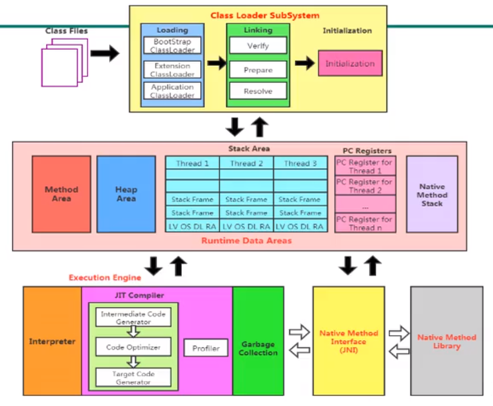

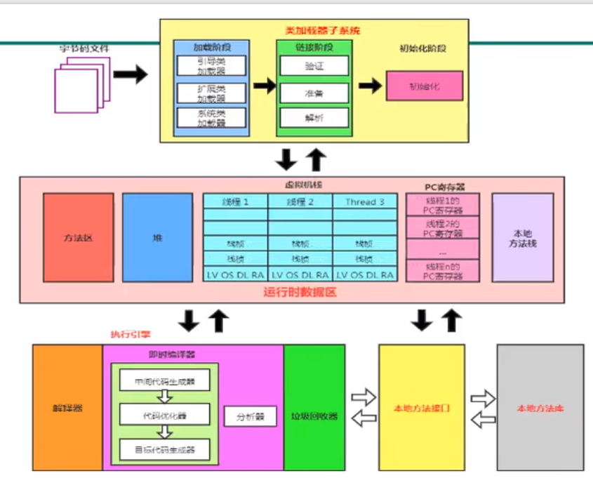

手写Java虚拟机，考虑实现：

- 类加载器
- 执行引擎

### 类加载子系统作用

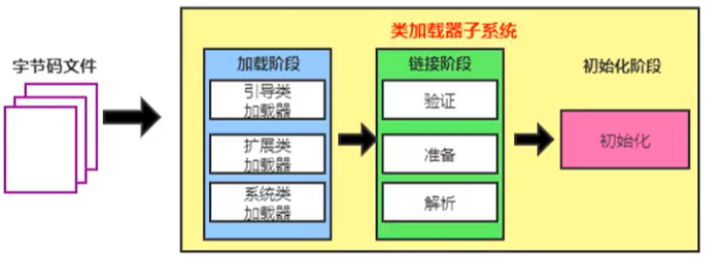

- 类加载子系统负责从文件系统或者网络中加载class文件，class文件在文件开头有特定的文件标识（cafebabe）。
- ClassLoader只负责class文件的加载，至于它是否可以运行，则由ExecutionEngine（执行引擎）决定。
- 加载的类信息存放于一块称为方法区的内存空间。除了类的信息之外，方法区中还会存放运行时常量池信息，可能还包括字符串字面量和数字常量（这部分常量信息是class文件中常量池部分的内存映射）

### 类加载器ClassLoader角色

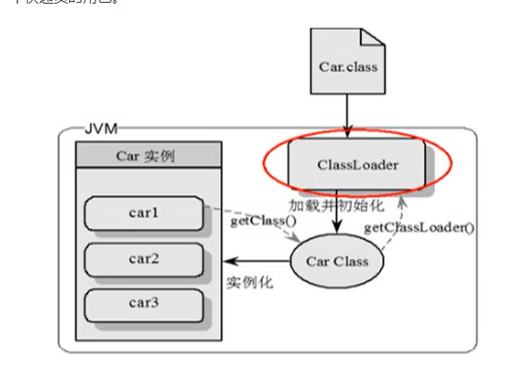

- class file存在于本地硬盘上，可以理解为设计师画在纸上的模板，而最终这个模板在执行的时候是要加载到JVM当中来根据这个文件实例化出n个一模一样的实例。
- class file加载到JVM中，被称为DNA元数据模板，放在方法区。
- 在.class文件 --> JVM -->最终成为元数据模板，此过程需要一个运输工具（类加载器ClassLoader），扮演一个快递员的角色

### 类加载的过程

代码：E:\jvm-demo\chapter02\src\main\java\cn\cq\jvm\HelloLoader.java

```java
/**
 * HelloLoader <br>
 *
 * @author CQ <br>
 * @version 1.0 <br>
 * @date 2020-09-10 14:02 <br>
 */
public class HelloLoader {
    public static void main(String[] args) {
        System.out.println("类加载过程");
    }
}
```


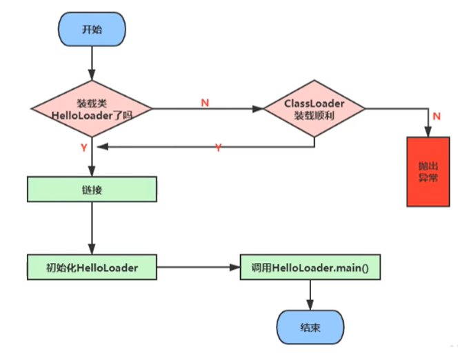

流程如下：

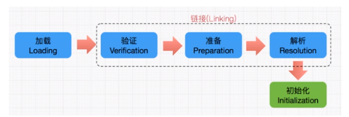

## 加载阶段Loading

1. 通过一个类的全限定名获取定义此类的二进制字节流
2. 将这个字节流所代表的的静态存储结构转化为方法区的运行时数据结构
3. **在内存中生成一个代表这个类的java.lang.Class对象**，作为方法区这个类的各种数据的访问入口

### 加载class文件的方式

- 从本地系统中直接加载
- 通过网络获取，典型场景：Web Applet
- 从zip压缩包中读取，成为日后jar、war格式的基础
- 运行时计算生成，使用最多的是：动态代理技术
- 由其他文件生成，典型场景：JSP应用从专有数据库中提取.class文件，比较少见
- 从加密文件中获取，典型的防Class文件被反编译的保护措施

## 链接阶段Linking

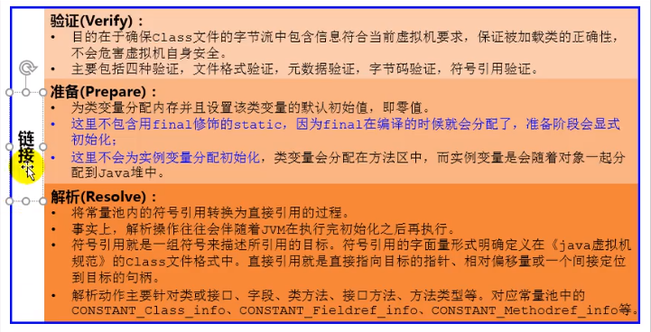

### 验证Verify

- 目的在于确保Class文件的字节流中包含信息符合当前虚拟机要求，确保被加载类的正确性，不会危害虚拟机自身安全。
- 主要包括四种验证，文件格式验证、元数据验证、字节码验证、符号引用验证

> 软件：Binary Viewer 

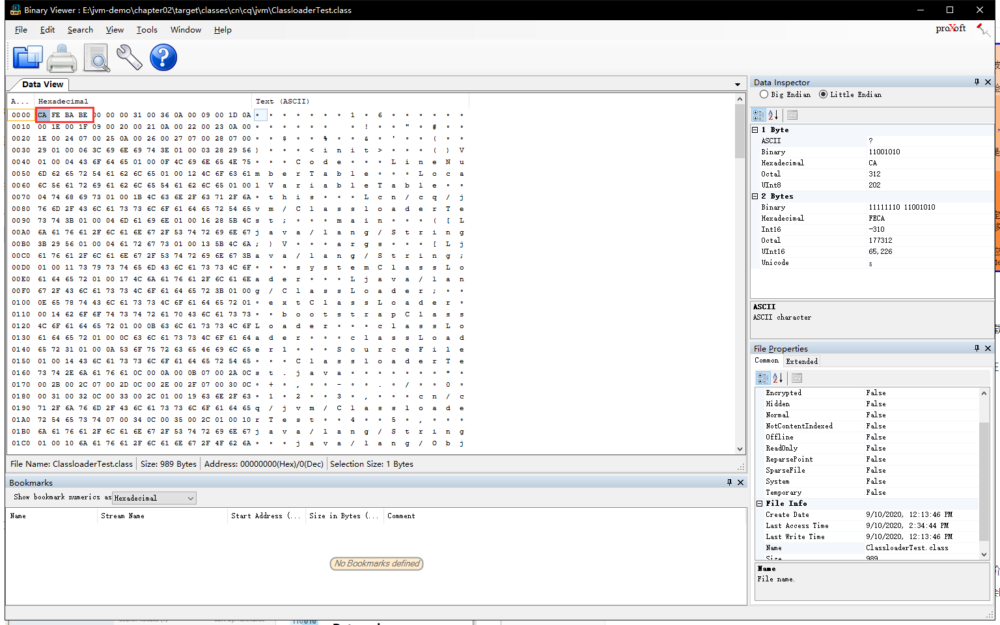

> IDEA插件：jclass

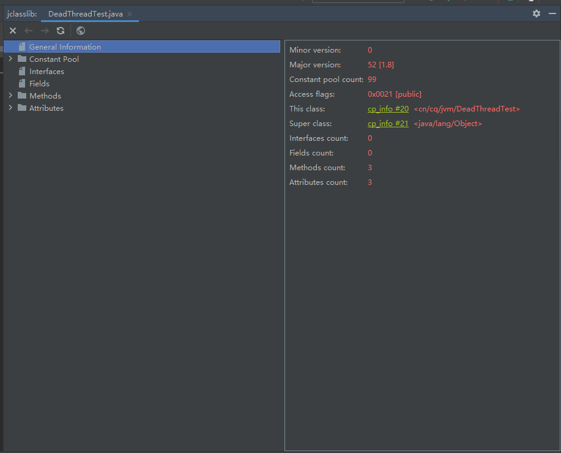


### 准备Prepare

- 为类变量分配内存并且设置该类变量的默认初始值，即零值。
- 这里不包含用final修饰的stating，因为final在编译的时候就会分配了，准备阶段会显式初始化。
- 这里不会为实例变量分配初始化，类变量会分配在方法区中，而实例变量是会随着对象一起分配到Java堆中。

举例：准备阶段为静态变量赋值

代码：E:\jvm-demo\chapter02\src\main\java\cn\cq\jvm\HelloApp.java

```java
/**
 * HelloApp <br>
 *
 * @author CQ <br>
 * @version 1.0 <br>
 * @date 2020-09-10 14:42 <br>
 */
public class HelloApp {
    //prepare准备阶段: a=0 ----> initial初始化阶段: a=1
    private static int a = 1;
    public static void main(String[] args) {
        System.out.println(a);
    }
}
```

上面的变量a在准备阶段会赋初始值，但不是1，而是0。

### 解析Resolve

- 将常量池内的符号引用转化为直接引用的过程。
- 事实上，解析操作往往会伴随着JVM在执行完初始化之后再执行。
- 符号引用就是一组符号来描述所引用的目标、符号引用的字面量形式明确定义在《java虚拟机规范》的Class文件格式中。直接引用就是直接指向目标的指针、相对偏移量或一个间接定位到目标的句柄。
- 解析动作主要针对类或接口、字段、类方法、接口方法、方法类型等。对应常量池中的CONSTANT_Class_info、CONSTANT_Fieldref_info、CONSTANT_Methodref_info等。

## 初始化阶段initialzation

- **初始化阶段就是执行类构造器方法<clinit>()的过程**
- 此方法不需要定义，是javac编译器自动收集类中的所有类静态变量的赋值动作和静态代码块中的语句合并而来。**如果类中没有类静态变量赋值和静态代码块，就不会有<clinit>()方法**
- 构造器方法中指令按语句在源文件中出现的顺序执行
- **<clinit>()不同于类的构造器**（关联：构造器是虚拟机视角下的<init>()）
- 若该类具有父类，JVM会保证子类的<clinit>()执行前，父类的<clinit>()已经执行完毕
- 虚拟机必须保证一个类的<clinit>()方法在多线程下被同步加锁
- 任何一个类声明以后，内部至少存在一个类的构造器--->产生<init>()方法

举例：加载顺序

代码：E:\jvm-demo\chapter02\src\main\java\cn\cq\jvm\ClassInitTest.java

```java
/**
 * ClassInitTest <br>
 *
 * @author CQ <br>
 * @version 1.0 <br>
 * @date 2020-09-10 15:07 <br>
 */
public class ClassInitTest {
    private static int num = 1;

    static {
        num = 2;
        number = 20;
        System.out.println(num);
        //System.out.println(number);//报错：非法的前向引用
    }

    //linking阶段的prepare: number =0 ---->initial:20-->10
    private static int number = 10;

    public static void main(String[] args) {
        System.out.println(num);//2
        System.out.println(number);//10
    }
}
```

举例：类的构造器   ---->   <init>()方法

代码：E:\jvm-demo\chapter02\src\main\java\cn\cq\jvm\ClinitTest.java

```java
/**
 * ClinitTest <br>
 *
 * @author CQ <br>
 * @version 1.0 <br>
 * @date 2020-09-10 15:12 <br>
 */
public class ClinitTest {
    //任何一个类声明以后，内部至少存在一个类的构造器
    private int a = 1;
    private static int c = 3;

    public static void main(String[] args) {
        int b = 2;
    }

    public ClinitTest() {
        a = 10;
        int d = 20;
    }
}
```

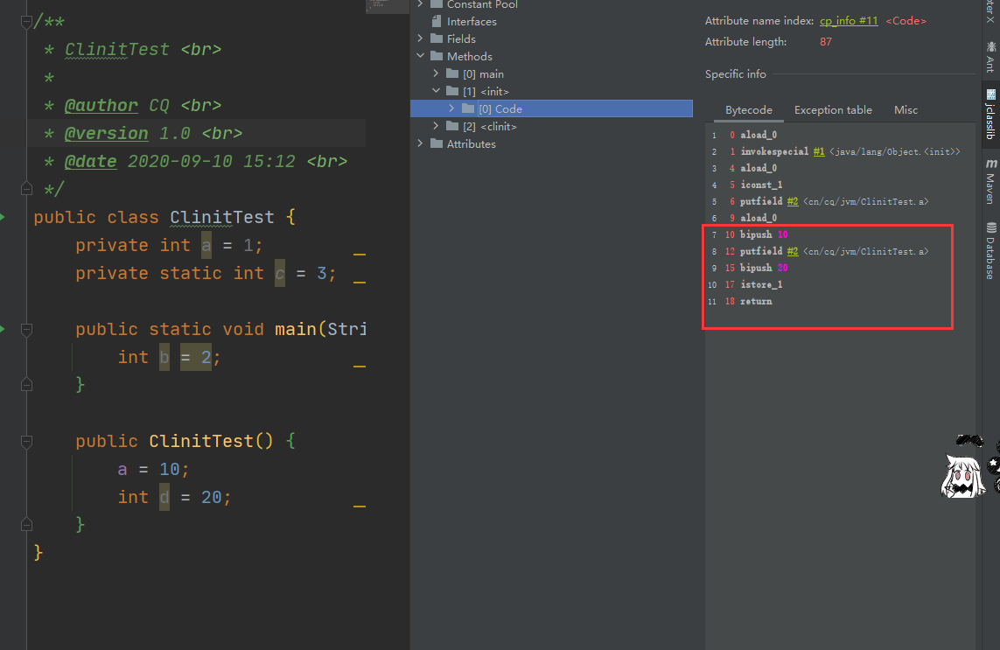

举例：父类的<clinit>()优先于子类的<clinit>()执行完毕

代码： E:\jvm-demo\chapter02\src\main\java\cn\cq\jvm\ClinitTest1.java

```java
/**
 * ClinitTest1 <br>
 *
 * @author CQ <br>
 * @version 1.0 <br>
 * @date 2020-09-10 15:26 <br>
 */
public class ClinitTest1 {
    static class Father {
        public static int A = 1;

        static {
            A = 2;
        }
    }

    static class Son extends Father {
        private static int B = A;
    }

    public static void main(String[] args) {
        //加载Father类，其次加载Son类
        System.out.println(Son.B);//2
    }
}
```

我们输出结果为 2，也就是说首先加载ClinitTest1的时候，会找到main方法，然后执行Son的初始化，但是Son继承了Father，因此还需要执行Father的初始化，同时将A赋值为2。我们通过反编译得到Father的加载过程，首先我们看到原来的值被赋值成1，然后又被复制成2，最后返回

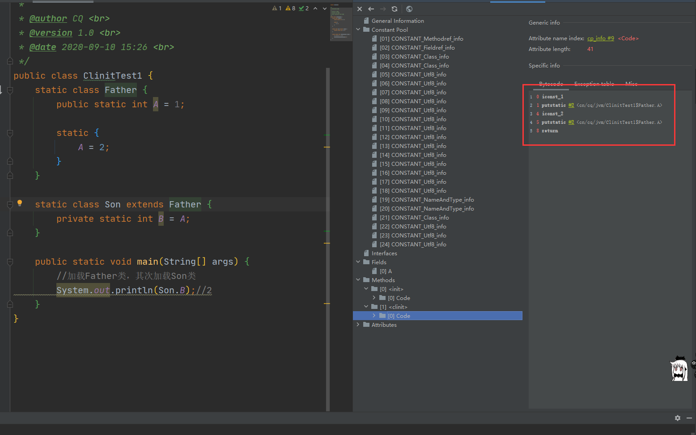

举例：虚拟机必须保证一个类的<clinit>()方法在多线程下被同步加锁

代码：E:\jvm-demo\chapter02\src\main\java\cn\cq\jvm\DeadThreadTest.java

```java
/**
 * DeadThreadTest <br>
 *
 * @author CQ <br>
 * @version 1.0 <br>
 * @date 2020-09-10 15:38 <br>
 */
public class DeadThreadTest {
    public static void main(String[] args) {
        Runnable r = () -> {
            System.out.println(Thread.currentThread().getName() + "开始");
            DeadThread deadThread = new DeadThread();
            System.out.println(Thread.currentThread().getName() + "结束");
        };
        Thread t1 = new Thread(r, "线程1");
        Thread t2 = new Thread(r, "线程2");
        t1.start();
        t2.start();
    }
}

class DeadThread {
    static {
        if (true) {
            System.out.println(Thread.currentThread().getName() + "初始化当前类！");
            while (true) {

            }
        }
    }
}
```

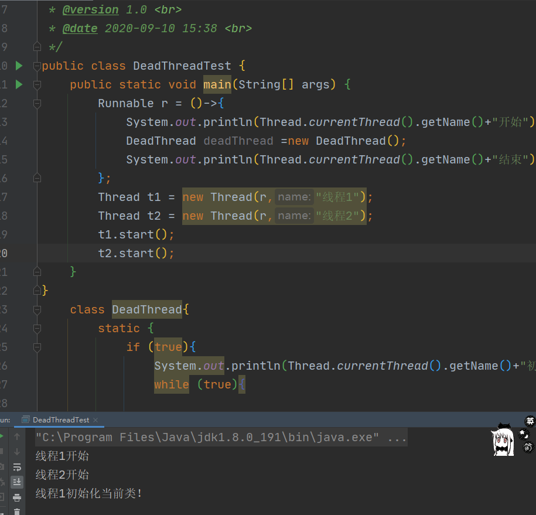

从上面可以看出初始化后，只能够执行一次初始化，这也就是同步加锁的过程

## 类加载器分类

- JVM支持两种类型的类加载器：

  - **引导类加载器（BootstrapCLassLoader）**
  - **自定义类加载器（User-Defined ClassLoader）**

- 概念上，自定义类加载器一般是程序中由开发人员自定义的一类加载器。但是Java虚拟机规范中规定，**将所有派生于抽象类ClassLoader的类加载器都划分为自定义类加载器。**只要间接继承就都划分为自定义类加载器

- 无论类加载器的类型如何划分，在程序中我们最常见的类加载器始终只有3个，如下：

  第一个属于引导类加载器，剩下属于自定义类加载器

  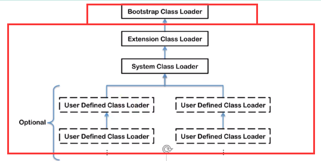

  **上述所有加载器之间是包含关系，不是上层下层，也不是父子类的继承关系。**

  举例：获取不同的加载器：

  代码：E:\jvm-demo\chapter02\src\main\java\cn\cq\jvm\ClassloaderTest.java
  
  ```java
  /**
   * ClassloaderTest <br>
   *
   * @author CQ <br>
   * @version 1.0 <br>
   * @date 2020-09-09 14:59 <br>
   */
  public class ClassloaderTest {
      public static void main(String[] args) {
          //获取系统类加载器
          ClassLoader systemClassLoader = ClassLoader.getSystemClassLoader();
          //sun.misc.Launcher$AppClassLoader@18b4aac2 系统类加载器是Launcher的内部类
          System.out.println(systemClassLoader);
  
          //获取其上层：扩展类加载器
          ClassLoader extClassLoader = systemClassLoader.getParent();
          //sun.misc.Launcher$ExtClassLoader@1b6d3586
          System.out.println(extClassLoader);
  
          //获取其上层：获取不到引导类加载器
          ClassLoader bootstrapClassLoader = extClassLoader.getParent();
          //null
          System.out.println(bootstrapClassLoader);
  
          //对于用户自定义类来说：默认使用系统类加载器进行加载
          ClassLoader classLoader = ClassloaderTest.class.getClassLoader();
          //sun.misc.Launcher$AppClassLoader@18b4aac2
          System.out.println(classLoader);
  
          //String类使用引导类加载器进行加载的。--->Java的核心类库都是使用引导类加载器进行加载
          ClassLoader classLoader1 = String.class.getClassLoader();
          //null
          System.out.println(classLoader1);
      }
}
  ```

  ​		从结果出发，**引导类加载器无法获取**，自定义的类加载器使用的是系统类加载器，String类的类加载器是null，即String类也是由引导类加载器加载的，推论出Java的核心类库是使用引导类加载器加载的。
  
  - 为什么无法获取引导类加载器？
    - 你是一个普通人，无法获取到国家核心机密。（表现）
    - 引导类加载器由C、C++实现，无法由Java获取其对象。（根因）

### 虚拟机自带的加载器

- **启动类加载器（引导类加载器，Bootstrap ClassLoader）**

  - 使用**C/C++语言实现**，嵌套在JVM内部，是JVM的一部分。
  - 用来加载Java核心类库（JAVA_HOME/jre/lib/rt.jar、resources.jar或sun.boot.class.path路径下的内容），用于提供JVM自身需要的类。
  - 并不继承自java.lang.ClassLoader，没有父加载器。（因为是用c/c++实现的，自然不继承Java的东西）。
  - 加载扩展类和应用程序类加载器，并指定为他们的父类加载器。
  - 出于安全考虑，Bootstrap启动类加载器只加载包名为java、javax、sun等开头的类。
- **扩展类加载器（Extension ClassLoader）**

  - **Java语言编写**，由sun.misc.Launcher$ExtClassLoader实现。
  - **派生于ClassLoader类**
  - 父加载器为启动类加载器
  - 从java.ext.dirs系统属性所指定的目录中加载类库，或从JDK的安装目录的jre/lib/ext子目录（扩展目录）下加载类库。**如果用户创建的JAR放在此目录下，也会自动由扩展类加载器加载。**
- **应用程序类加载器（系统类加载器，AppClassLoader）**

  - **Java语言编写**，由sun.misc.Launcher$AppClassLoader实现
- **派生于ClassLoader类**
  
  - 父加载器为扩展类加载器
- 加载环境变量classpath或系统属性java.class.path指定路径下的类库
  
  - 是**程序中默认的类加载器**，一般来说，Java应用的类都是由它来完成的
- 通过ClassLoader.getSystemClassLoader()方法可以获取到该类加载器
- **用户自定义类加载器**
  - 在Java的日常应用程序开发中，类的加载几乎是由上述三种类加载器相互配合执行，在必要时，我们还可以自定义类加载器，来制定类的加载方式。
  
  - **为什么要自定义类加载器？**
    - 隔离加载类（引用不同中间件时防止类的冲突，一个项目中使用多套框架）
    - 修改类加载的方式（除了必须使用的BootstrapClassLoader，可以选择不加载，需要时再加载）
    - 扩展加载源（从另外的地方获取class文件，比如外部存储）
    - 防止源码泄漏（加载时解密加密过的class）
    
  - 用户自定义类加载器实现步骤
    - 开发人员可以通过继承抽象类java.lang.ClassLoader类的方式，实现自己的类加载器，以满足一些特殊的需求。
    - 在JDK1.2之前，在自定义类加载器时，总会去继承ClassLoader类并重写loadClass()方法，从而实现自定义的类加载器。JDK1.2之后，不再建议用户去覆盖loadClass()方法（过于繁琐），而是建议把自定义的类加载器逻辑写在findClass()方法中。
    - 在编写自定义类加载器时，如果没有太过于复杂的需求，可以直接继承URLClassLoader类，这样可以避免自己去编写findClass()方法及其获取字节码流的方式，使自定义类加载器编写更加简洁。
    
    举例：继承ClassLoader实现findClass()方法自定义类加载器
    
    代码：E:\jvm-demo\chapter02\src\main\java\cn\cq\jvm\CustomClassLoader.java
    
    ```java
    /**
     * CustomClassLoader <br>
     *
     * @author CQ <br>
     * @version 1.0 <br>
     * @date 2020-09-09 16:51 <br>
     */
    public class CustomClassLoader extends ClassLoader {
        @Override
        protected Class<?> findClass(String name) throws ClassNotFoundException {
            try {
                byte[] result = getClassFromCustomPath(name);
                if (result == null) {
                    throw new FileNotFoundException();
                } else {
                    return defineClass(name, result, 0, result.length);
                }
            } catch (FileNotFoundException e) {
                e.printStackTrace();
            }
            throw new ClassNotFoundException(name);
        }
    
        private byte[] getClassFromCustomPath(String name) {
            //从自定义路径中加载指定类，获取字节码流
            //如果指定路径的字节码文件进行了加密，则需要在此方法中进行解密操作
            return null;
        }
    
        public static void main(String[] args) {
            try {
                CustomClassLoader customClassLoader = new CustomClassLoader();
                Class<?> clazz = Class.forName("One", true, customClassLoader);
                Object o = clazz.newInstance();
                System.out.println(o.getClass().getClassLoader());
            } catch (Exception e) {
                e.printStackTrace();
            }
        }
    }
    
    ```
    
    

举例：获取类加载器，启动类加载器获取不到

代码：E:\jvm-demo\chapter02\src\main\java\cn\cq\jvm\ClassLoaderTest1.java

  ```java
  /**
   * ClassLoaderTest1 <br>
   *
   * @author CQ <br>
   * @version 1.0 <br>
   * @date 2020-09-09 15:56 <br>
   */
  public class ClassLoaderTest1 {
      public static void main(String[] args) {
          System.out.println("***********启动类加载器************");
          //获取BootstrapClassLoader能够加载的api路径
          URL[] urLs = Launcher.getBootstrapClassPath().getURLs();
          for (URL url:urLs) {
              System.out.println(url.toExternalForm());
          }
          //从上述路径选择一个类，查看类加载器：引导类加载器
          ClassLoader classLoader = Provider.class.getClassLoader();
          //null
          System.out.println(classLoader);
  
          System.out.println("***********扩展类加载器************");
          String property = System.getProperty("java.ext.dirs");
          for (String path:property.split(";")) {
              System.out.println(path);
          }
          //从上述路径选择一个类，查看类加载器：扩展类加载器
          ClassLoader classLoader1 = CurveDB.class.getClassLoader();
          //sun.misc.Launcher$ExtClassLoader@4b67cf4d
          System.out.println(classLoader1);
  
      }
  }
  ```

  输出结果：

  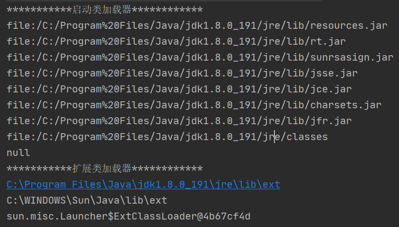

## 关于ClassLoader

ClassLoader类是一个抽象类，其后所有的类的加载器都继承自ClassLoader（不包括启动类加载器）

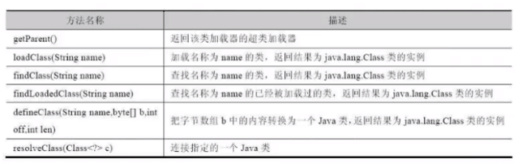

扩展关系：

sun.misc.Launcher是一个Java虚拟机的入口应用

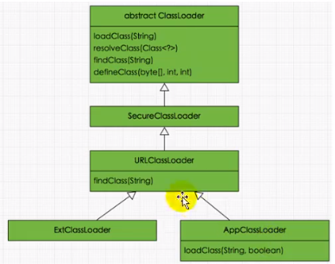

获取类加载器方式：

代码：E:\jvm-demo\chapter02\src\main\java\cn\cq\jvm\ClassLoaderTest2.java

- 获取当前类的ClassLoader

  `clazz.getClassLoader();`

- 获取当前线程上下文的ClassLoader

  `Thread.currentThread().getContextClassLoader();`

- 获取系统的ClassLoader

  `ClassLoader.getSystemClassLoader();`

- 获取调用者的ClassLoader

  `DriverManager.getCallerClassLoader();`


## 双亲委派机制

Java虚拟机对class文件采用的是**按需加载**的方式，也就是说当需要使用该类时才会将它的class文件加载到内存生成class对象。而且加载某个类的class文件时，Java虚拟机采用的是**双亲委派模式**，即把请求交由父类处理，它是一种任务委派模式。

### 工作原理

1. 如果一个类加载器收到了类加载请求，它并不会自己先去加载，而是把这个请求委托给父类的加载器去执行；
2. 如果父类加载器还存在其父类加载器，则进一步向上委托，依次递归，请求最终将达到顶层的启动类加载器；
3. 如果父类加载器可以完成类加载任务，就成功返回。倘若父类加载器无法完成此加载任务，子类加载器才会尝试自己去加载，这就是双亲委派模式。

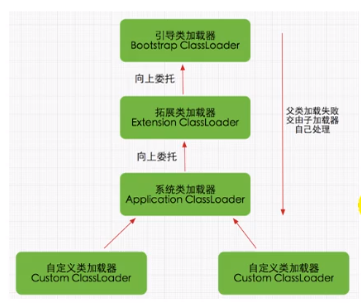

### 沙箱安全机制

自定义string类，但是在加载自定义String类的时候会率先使用引导类加载器加载，而引导类加载器在加载的过程中会先加载jdk自带的文件（rt.jar包中java\lang\String.class），报错信息说没有main方法，就是因为加载的是rt.jar包中的string类。这样可以保证对java核心源代码的保护，这就是**沙箱安全机制**。

代码：E:\jvm-demo\chapter02\src\java\lang\String.java

### 双亲委派机制举例

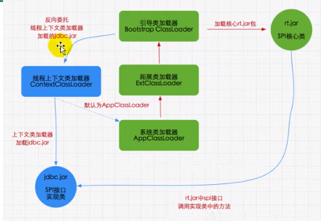

当我们加载jdbc.jar用于数据库连接的时候，首先我们需要知道的是jdbc.jar是基于SPI接口实现的，所以在加载时会进行双亲委派，最终从引导类加载器中加载SPI核心类（rt.jar）。然后加载SPI接口类，接着再进行反向委托，通过线程上下文类加载器进行实现类jdbc.jar的加载。

使用jdbc时，就是使用SPI接口，此时发生双亲委派机制，会用启动类加载器加载SPI接口的核心类即rt.jar。因为SPI只是一个接口类，所以加载过程中会有一些具体的实现方法，这时就需要使用第三方包里面方法，此时会发生反向委托，通过线程上下文类加载器ContextClassLoader（系统类加载器AppClassLoader）去加载具体实现方法。至此完成jdbc.jar的加载。

### 双亲委派机制优势

- 避免类的重复加载

  让父类去进行加载，保证只加载一次

- 保护程序安全，防止核心API被随意篡改

  - 自定义类：java.lang.String

    只会从启动类加载器中加载lang包下的核心类库

    代码：E:\jvm-demo\chapter02\src\java\lang\String.java

  - 自定义类：java.lang.CqTest

    lang包下类库是被保护起来的，不能直接在lang包下自定义类**java.lang.SecurityException: Prohibited package name: java.lang**

    代码：E:\jvm-demo\chapter02\src\java\lang\CqTest.java

