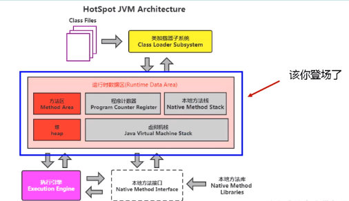
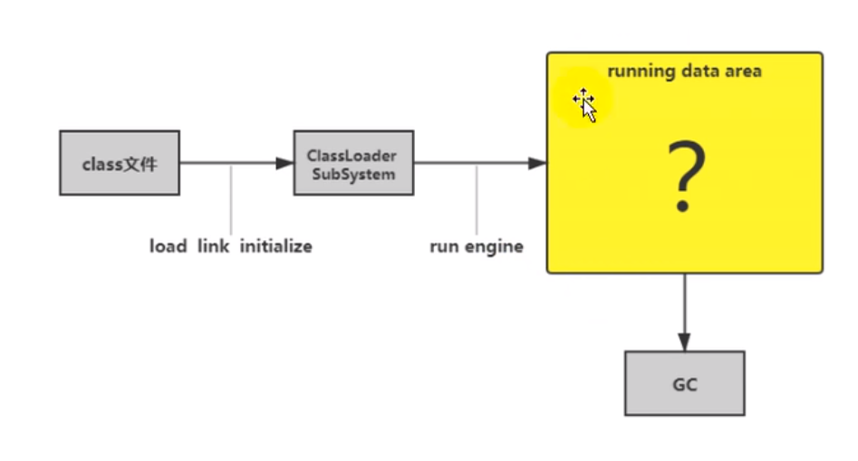
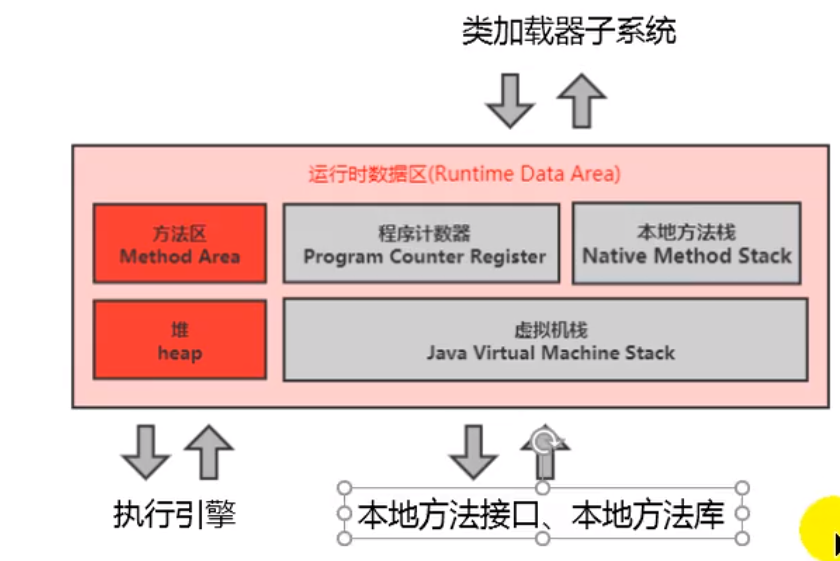
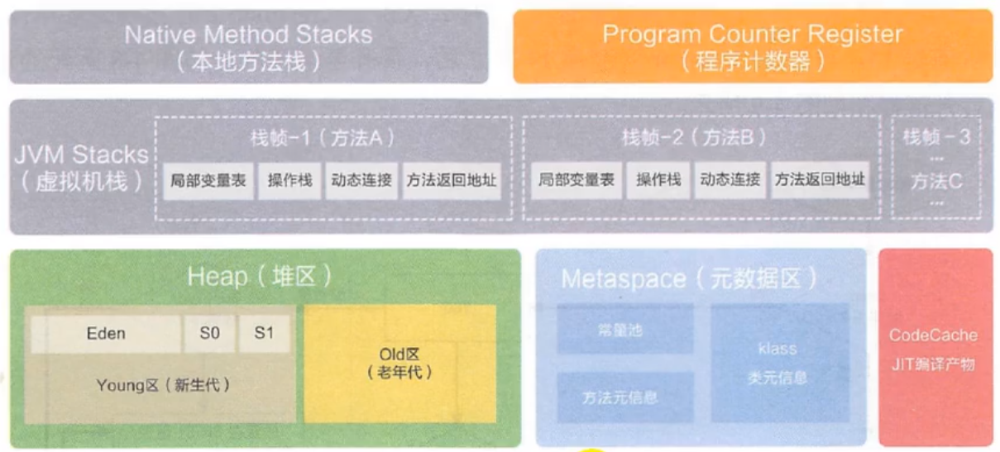
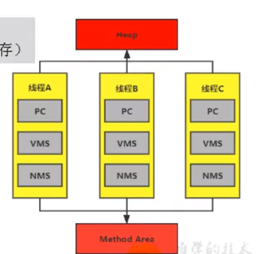

# 运行时数据区概述及线程

## 概述

我们通过前面的：类的加载->验证->准备->解析->初始化 这几个阶段完成后，就会用到执行引擎对我们的类进行使用，同时执行引擎将会使用到我们运行时数据区

也就是大厨做饭，我们把大厨后面的东西（切好的菜，刀，调料），比作是运行时数据区。而厨师可以类比于执行引擎，将通过准备的东西进行制作成精美的菜品，做完之后会收拾桌面也就是相当于GC

内存是非常重要的系统资源，是硬盘和CPU的中间仓库及桥梁，承载着操作系统和应用程序的实时运行。JVM内存布局规定了Java在运行过程中内存申请、分配、管理的策略，保证了JVM的高效稳定运行。**不同的JVM对于内存的划分方式和管理机制存在部分差异**。结合JVM虚拟机规范，来探讨下经典的JVM内存布局。

> 我们通过磁盘或者网络得到的数据，都需要先加载到内存中，然后CPU从内存中获取数据进行读取，也就是说内存是CPU和磁盘之间的桥梁。

运行时数据区完整图

Java虚拟机定义了若干种程序运行期间会使用到的运行时数据区，其中有一些会随着虚拟机启动而创建，随着虚拟机退出而销毁。另外一些则是与线程一一对应的，这些与线程对应的数据区域会随着线程开始和结束而创建和销毁。

灰色的为单独线程私有的，红色的为多个线程共享，即：

- 每个线程：独立拥有包括程序计数器、虚拟机栈、本地方法栈。
- 线程间共享：堆、堆外内存（永久代或元空间（方法区）、代码缓存（JIT代码缓存））

## 线程

- 线程是一个程序里的运行单元。JVM允许一个应用程序有多个线程并行执行
- 在Hotspot JVM里，每个线程都与操作系统的本地线程直接映射
  - 当一个Java线程准备好执行以后，此时一个操作系统的本地线程也同时创建。Java线程执行终止后，本地线程也会回收
- 操作系统负责所有线程的安排调度到任何一个可用的CPU上。一旦本地线程初始化成功它就会调用Java线程中的run()方法。

### JVM系统线程

​        如果你使用jconsole或者是任何一个调试工具，都能看到在后台有许多线程在运行。这些后台线程不包括调用public static void main（String[]）的main线程以及所有这个main线程自己创建的线程。
这些主要的后台系统线程在Hotspot JVM里主要是以下几个：

- 虚拟机线程：这种线程的操作是需要JVM达到安全点才会出现。这些操作必须在不同的线程中发生的原因是他们都需要JVM达到安全点，这样堆才不会变化。这种线程的执行类型包括"stop-the-world"的垃圾收集，线程栈收集，线程挂起以及偏向锁撤销。
- 周期任务线程：这种线程是时间周期事件的体现（比如中断），他们一般用于周期性操作的调度执行。
- GC线程：这种线程对在JVM里不同种类的垃圾收集行为提供了支持。
- 编译线程：这种线程在运行时会将字节码编译成到本地代码。
- 信号调度线程：这种线程接收信号并发送给JVM，在它内部通过调用适当的方法进行处理。