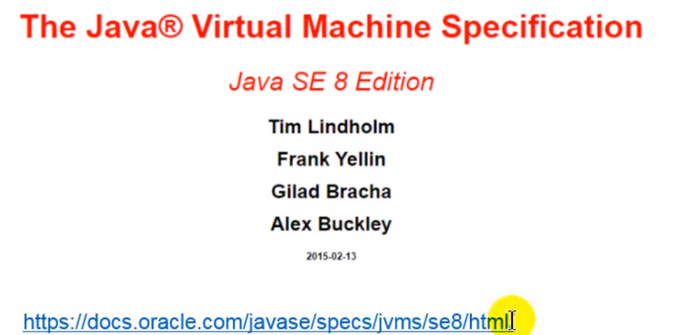
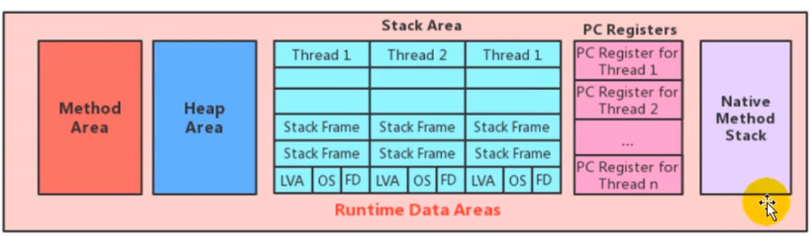
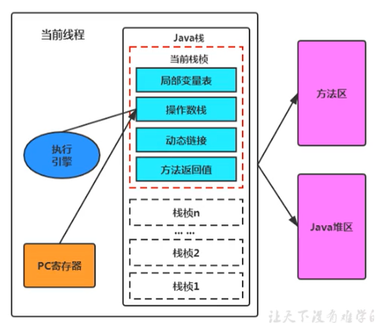
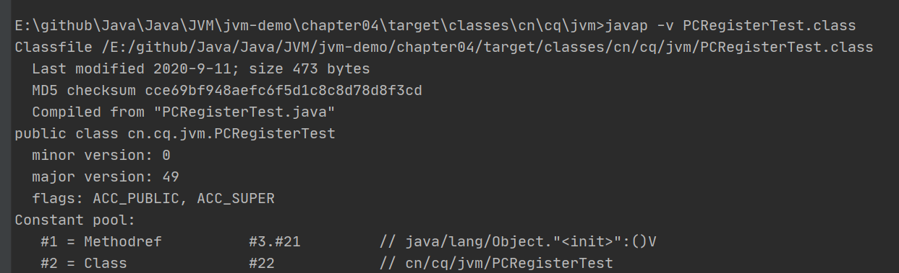
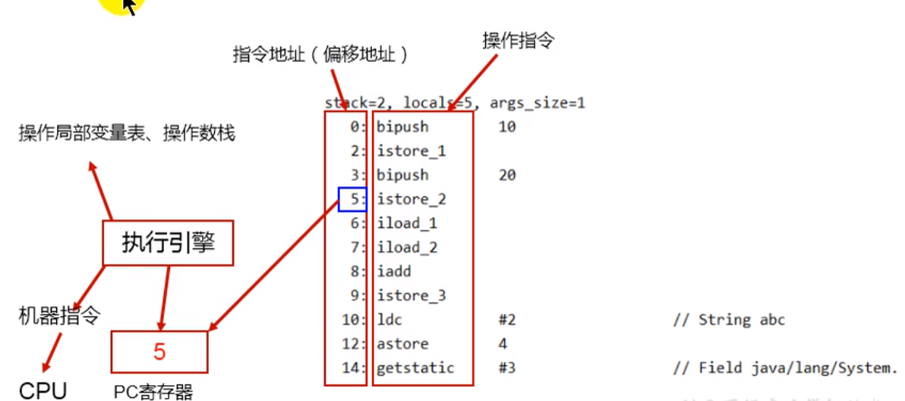
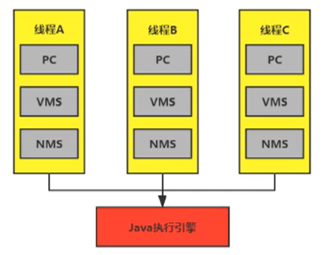
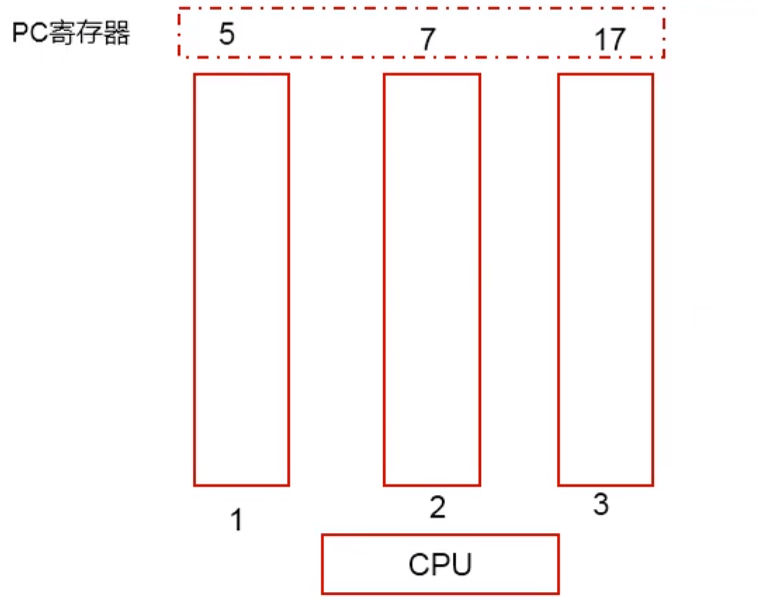

# 程序计数器（PC寄存器）

## PC Register介绍



https://docs.oracle.com/javase/specs/index.html



JVM中的程序计数寄存器（Program Counter Register）中，Register的命名源于CPU的寄存器，寄存器存储指令相关的现场信息。CPU只有把数据装载到寄存器才能够运行。

这里，并非是广义上所指的物理寄存器，或许将其翻译为pc计数器（或指令计数器）会更加贴切（也成为程序钩子），并且也不容易引起一起不必要的误会。**JVM中的pc寄存器是对物理pc寄存器的一种抽象模拟**。


- 它是一块很小的内存空间，几乎可以忽略不计。也是运行速度最快的存储区域。
- 在JVM规范中，每个线程都有它自己的程序计数器，是线程私有的，生命周期和线程的生命周期保持一致。
- 任何时间一个线程都只有一个方法在执行，也就是所谓的**当前方法**。程序计数器会存储当前线程正在执行的Java方法的JVM指令地址；或者，如果是在执行native方法（C/C++中方法），则是未指定值（undefine）（Java记录不了c中的东西）。
- 它是程序控制流的指示器，分支、循环、跳转、异常处理、线程恢复等基础功能都需要依赖这个计数器来完成。
- 字节码解释器工作时就是通过改变这个计数器的值来选取下一条需要执行的字节码指令。
- 它是唯一一个在Java虚拟机规范中没有规定任何OutOtMemoryError情况的区域。没有GC。（程序计算器仅仅只是一个运行指示器，它所需要存储的内容仅仅就是下一个需要待执行的命令的地址，无论代码有多少，最坏情况下死循环也不会让这块内存区域超限，因为程序计算器所维护的就是下一条待执行的命令的地址，所以不存在OutOfMemoryError）

## 作用

PC寄存器用来存储指向下一条指令的地址，也即将要执行的指令代码。由执行引擎读取下一条指令。



## 举例


代码：E:\github\Java\Java\JVM\jvm-demo\chapter04\src\main\java\cn\cq\jvm\PCRegisterTest.java

```java
/**
 * PCRegisterTest <br>
 *
 * @author CQ <br>
 * @version 1.0 <br>
 * @date 2020-09-11 11:31 <br>
 */
public class PCRegisterTest {
    public static void main(String[] args) {
        int i = 10;
        int j = 10;
        int k = i + j;
    }
}
```

然后将代码进行编译成字节码文件(javap -v)，我们再次查看 ，发现在字节码的左边有一个行号标识，它其实就是指令地址，用于指向当前执行到哪里。



```bash
0: bipush        10
2: istore_1
3: bipush        20
5: istore_2
6: iload_1
7: iload_2
8: iadd
9: istore_3
10: return
```

通过PC寄存器，我们就可以知道当前程序执行到哪一步了 




## 常见问题

### 使用PC寄存器储存字节码指令地址有什么用？

等价于：**为什么使用PC寄存器记录当前线程的执行地址？**

- 因为CPU需要不停的切换各个线程，这时候切换回来之后，就得知道接着从哪开始继续执行。
- JVM的字节码解释器就需要通过改变PC寄存器的值来明确下一条应该执行什么样的字节码指令。



### PC寄存器为什么会被设定为线程私有？

​        我们都知道所谓的多线程在一个特定的时间段内只会执行其中某一个线程的方法，CPU会不停地做任务切换，这样必然导致经常中断或恢复，如何保证分毫无差呢？**为了能够准确地记录各个线程正在执行的当前字节码指令地址，最好的办法自然是为每一个线程都分配一个PC寄存器**，这样一来各个线程之间便可以进行独立计算，从而不会出现相互干扰的情况。

​		由于CPU时间片轮限制，众多线程在并发执行过程中，任何一个确定的时刻，一个处理器或者多核处理器中的一个内核，只会执行某个线程中的一条指令。这样必然导致经常中断或恢复，如何保证分毫无差呢？每个线程在创建后，都会产生自己的程序计数器和栈帧，程序计数器在各个线程之间互不影响。



### CPU时间片

CPU时间片即CPU分配给各个程序的时间，每个线程被分配一个时间段，称作它的时间片。

在宏观上：俄们可以同时打开多个应用程序，每个程序并行不悖，同时运行。

但在微观上：由于只有一个CPU，一次只能处理程序要求的一部分，如何处理公平，一种方法就是引入时间片，每个程序轮流执行。

