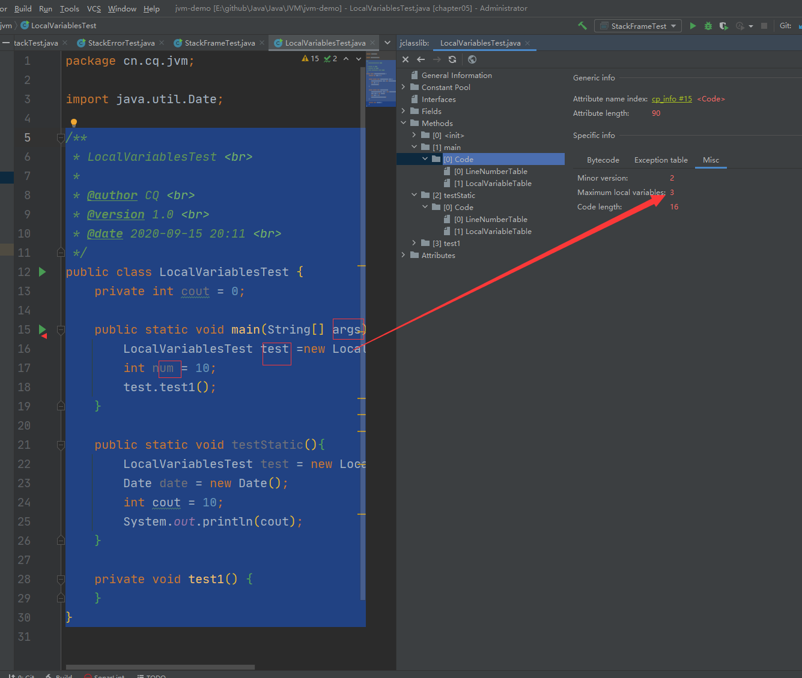

# 虚拟机栈

## 虚拟机栈概述

### 虚拟机栈出现的背景

​		由于跨平台性的设计，Java的指令都是根据栈来设计的。不同平台CPU架构不同，所以不能设计为基于寄存器的。

​		**优点：跨平台，指令集小（8位对齐），编译器容易实现**

​		**缺点：性能下降，实现同样的功能需要更多的指令**

​		有不少Java开发人员一提到Java内存结构，就会非常粗粒度的将JVM中的内存区理解为仅有Java堆（heap）和Java栈（stack）？为什么？（不全面。因为堆、栈比较重要，只记得这两个，C和C++中主体就是这两个 ）。

​		**栈是运行时单位，而堆是储存单位**

- 栈解决程序的运行问题。即程序如何运行，或者说如何处理数据。
- 堆解决的是数据存储的问题。即数据怎么放、放在哪。


### 虚拟机栈基本内容

#### Java虚拟机栈是什么？

Java虚拟机栈（Java Virtual Machine Stack），早期也叫Java栈。每个线程在创建时都会创建一个虚拟机栈，其内部保存一个个的栈帧（Stack Frame），对应着一次次的Java方法调用。

> 是线程私有的

代码：E:\github\Java\Java\JVM\jvm-demo\chapter05\src\main\java\cn\cq\jvm\StackTest.java


#### 生命周期

生命周期和线程一致

#### 作用

主管Java程序的运行，它保存方法的局部变量（8种基本数据类型、对象的引用地址）、部分结果，并参与方法的调用和返回。

> 局部变量 vs 成员变量（或属性）
>
> 基本数据类型变量 vs 引用类型变量（类、数组、接口）

#### 栈的特点（优点）FILO

- 栈是一种快速有效的分配存储方式，访问速度仅次于程序计数器。

- JVM直接对Java栈的操作只有两个：

  > 每个方法执行，伴随着进栈（入栈、压栈）
  >
  > 执行结束后的出栈操作

- 对于栈来说不存在垃圾回收问题（栈存在溢出的情况）

  > 不存在GC;存在OOM


#### 开发中遇到的异常有哪些？

##### 栈中可能出现的异常

- Java虚拟机规范允许**Java栈的大小是动态的或者是固定不变的**

  - 如果采用固定大小的Java虚拟机栈，那每一个线程的Java虚拟机栈容量可以在线程创建时独立选定。如果线程请求分配的栈容量超过Java虚拟机栈允许的最大容量，Java虚拟机会抛出一个**StackOverflowError**异常。

  演示：StackOverflowError

  代码：E:\github\Java\Java\JVM\jvm-demo\chapter05\src\main\java\cn\cq\jvm\StackErrorTest.java

  ```java
  /**
   * StackErrorTest <br>
   * 演示栈中异常:StackOverflowError
   * 默认情况下：cout：11412
   * 设置栈的大小：-Xss256k cout: 2468
   *
   * @author CQ <br>
   * @version 1.0 <br>
   * @date 2020-09-11 15:37 <br>
   */
  public class StackErrorTest {
      private static int cout = 1;
      public static void main(String[] args) {
          System.out.println(cout);
          cout++;
          main(args);
      }
  }
  ```

  

  - 如果Java虚拟机栈可以动态扩展，并且在尝试扩展的时候无法申请到足够的内存，或者在创建新的线程时没有足够的内存去创建对应的虚拟机栈，那Java虚拟机将会抛出一个**OutOfMemoryError**异常。

##### 设置栈内存大小

```java
  -Xss1m
  -Xss1k
```

 		我们可以使用参数 -Xss选项来设置线程的最大栈空间，栈的大小直接决定了函数调用的最大可达深度。

## 栈的存储单位

### 栈中存储什么？

- 每个线程都有自己的栈，栈中的数据都是以**栈帧（Stack Frame）**的格式存在
- 在这个线程上正在执行的每个方法都各自对应一个栈帧（Stack Frame）
- 栈帧是一个内存区域，是一个数据集，维系着方法执行过程中的各种数据信息

> OOP（面向对象）的基本概念：类、对象
>
> 类中基本结构：field（属性、字段、域）、method（方法）


### 栈运行原理

- JVM直接对Java栈的操作只有两个，就是对栈帧的**压栈**和**出栈**，遵循**先进后出，后进先出**的原则

- 在一条活动线程中，一个时间点上，只会有一个活动的栈帧。即当前正在执行的方法的栈帧（栈顶栈帧）是有效的，这个栈帧被称为**当前栈帧（Current Frame）**，与当前栈帧对应的方法就是**当前方法（Current Method）**，定义这个方法的类就是**当前类（Current Class）**。

- 执行引擎运行的所有字节码指令只针对当前栈帧进行操作

- 如果在该方法中调用了其他方法，对应的新的栈帧会被创建出来，放在栈的顶端，成为新的当前栈帧。

  

举例：栈帧调用举例

代码：E:\github\Java\Java\JVM\jvm-demo\chapter05\src\main\java\cn\cq\jvm\StackFrameTest.java

```java
/**
 * StackFrameTest <br>
 *
 * @author CQ <br>
 * @version 1.0 <br>
 * @date 2020-09-14 20:05 <br>
 */
public class StackFrameTest {
    public static void main(String[] args) {
        method01();
    }

    private static int method01() {
        System.out.println("方法1的开始");
        int i = method02();
        System.out.println("方法1的结束");
        return i;
    }

    private static int method02() {
        System.out.println("方法2的开始");
        int i = method03();;
        System.out.println("方法2的结束");
        return i;
    }
    private static int method03() {
        System.out.println("方法3的开始");
        int i = 30;
        System.out.println("方法3的结束");
        return i;
    }
}
```

idea断点观察栈帧


- 不同线程所包含的栈帧是不允许存在相互调用的，即不可能在一个栈帧之中引用另外一个线程的栈帧。（栈帧都是独立的）
- 如果当前方法调用了其他方法，方法返回之际，当前栈帧会传回此方法的执行结果给前一个栈帧，接着，虚拟机会丢弃当前栈帧使得前一个栈帧重新成为当前栈帧。
- Java方法有两种返回函数的方式，**一种是正常的函数返回，使用return指令；另外一种是抛出异常，不管使用那种方式，都会导致栈帧被弹出**

### 栈帧内部结构

每个栈帧中存储着：

- **局部变量表（Local Variables）**

- **操作数栈（Operand Stack）（或表达式栈）**

- 动态链接（Dynamic Linking）（或指向运行时常量池的方法引用）

- 方法返回地址（Return Address）（或方法正常退出或异常退出的定义）

- 一些附加信息

  

  ​		

  **栈帧的大小主要由局部变量表 和 操作数栈决定的**

  ​		并行每个线程下的栈都是私有的，因此每个线程都有自己各自的栈，并且每个栈里面都有很多栈帧


## 局部变量表

- 局部变量表也被称之为局部变量数组或本地变量表

- **定义为一个数字数组，主要用于存储方法参数和定义在方法体内的局部变量**，这些数据类型包括各种基本数据类型、对象引用（reference），以及returnAddress类型

- 由于局部变量表是建立在线程的栈上，是线程的私有数据，因此不存在**数据安全性问题**（指多个线程操作某个共享数据引发的安全性问题）

- **局部变量表所需的容量大小是在编译期确定下来的**，并保存在方法的Code属性的maximum local variables数据项中。在方法运行期间是不会改变局部变量表大小的。

  

- **方法嵌套调用的次数由栈大小决定**。一般来说，**栈越大，方法嵌套调用次数越多**。对一个函数而言，它的参数和局部变量越多，使得局部变量表膨胀，它的栈帧就越大，以满足方法调用所需传递的信息增大的需求。进而函数调用就会占用更多的栈空间，导致其嵌套调用的次数就会减少。

- **局部变量表中的变量只在当前方法调用中有效**。在方法执行时，虚拟机通过使用局部变量表完成参数值到参数变量列表的传递过程。**当方法调用结束后，随着方法栈的销毁，局部变量表也会随之下销毁**。

  举例：字节码查看

  代码：E:\github\Java\Java\JVM\jvm-demo\chapter05\src\main\java\cn\cq\jvm\LocalVariablesTest.java

  ```java
  /**
   * LocalVariablesTest <br>
   *
   * @author CQ <br>
   * @version 1.0 <br>
   * @date 2020-09-15 20:11 <br>
   */
  public class LocalVariablesTest {
      private int cout = 0;
  
      public static void main(String[] args) {
          LocalVariablesTest test =new LocalVariablesTest();
          int num = 10;
          test.test1();
      }
  
      public static void testStatic(){
          LocalVariablesTest test = new LocalVariablesTest();
          Date date = new Date();
          int cout = 10;
          System.out.println(cout);
      }
  
      private void test1() {
      }
  }
  
  ```

  main方法：

  

  

  

  对应作用域Stack Pc到Lenth，加起来等于方法总作用域

  

### 关于Slot的理解

- 参数值的存放总是在局部变量数组的index0开始，到数组长度-1的索引结束

- 局部变量表，**最基本的储存单元是Slot（变量槽）**

- 局部变量表中存放编译期可知的各种基本数据类型（8种），引用类型（reference），returnAddress类型的变量

- 在局部变量表里，**32位以内的类型只占用一个slot（包括returnAddress类型），64位的类型（long和double）占用两个slot**

  > byte、short、char、float在存储前被转化为int，boolean也被转换为int，0表示flase，非0表示true
  >
  > long和double则占据两个slot

- JVM会为局部变量表中的每一个slot都分配一个访问索引，通过这个索引即可成功访问到局部变量表中指定的局部变量值

- 当一个实例方法被调用的时候，它的方法参数和方法体内部定义的局部变量将会**按照顺序被复制**到局部变量表中的每一个slot上

- **如果需要访问局部变量表中一个64bit的局部变量值时，只需要使用前一个索引即可**（比如：访问long和double类型变量）

- 如果当前帧是由构造方法或者实例方法创建的，那么**该对象引用this将会存放在index为0的slot处**，其余的参数按照参数表顺序继续排序。

  - 现在我们就可解释为什么静态方法中无法使用this调用
  - 因为this变量不存在与当前方法的局部变量表中
  - 其实就是因为static修饰的方法，不需要当前对象就可以直接调用。

  

### slot重复利用

**栈帧中局部变量表的槽位是可以重用的**，如果一个局部变量表过了其作用域，在么在其作用域之后申明的新局部变量就很有可能会复用过期局部变量的槽位，从而**达到节省资源的目的**。

代码：E:\github\Java\Java\JVM\jvm-demo\chapter05\src\main\java\cn\cq\jvm\LocalVariablesTest.java

```java
/**
 * LocalVariablesTest <br>
 *
 * @author CQ <br>
 * @version 1.0 <br>
 * @date 2020-09-15 20:11 <br>
 */
public class LocalVariablesTest {
    private int cout = 0;

    public static void main(String[] args) {
        LocalVariablesTest test = new LocalVariablesTest();
        int num = 10;
        test.test1();
    }

    public LocalVariablesTest() {
        cout = 1;
    }

    public static void testStatic() {
        LocalVariablesTest test = new LocalVariablesTest();
        Date date = new Date();
        int cout = 10;
        System.out.println(cout);
        //因为this变量不存在于当前方法的局部变量表中！！
        //System.out.println(this.cout);
    }

    public void test1() {
        Date date = new Date();
        String name1 = "cq";
        String info = test2(date, name1);
        System.out.println(date + name1);
    }

    public String test2(Date dateP, String name2) {
        dateP = null;
        name2 = "cq1";
        double weight = 140;
        char gender = '男';
        return dateP + name2;
    }

    public void test3() {
        cout++;
    }

    public void test4() {
        int a = 0;
        {
            int b = 0;
            b = a + 1;
        }
        int c = a + 1;
    }
}

```

举例：slot的重复利用

b的slot释放后重新赋值给c


举例：构造方法和实例方法中会有this对象


举例：double变量占用两个slot，使用时取第一个索引


### 举例：静态变量与局部变量的对比

> 变量的分类：
>
> - 按照数据类型分：
>
>   - 基本数据类型
>   - 引用数据类型
>
> - 按照在类中声明的位置分：
>
>   - 成员变量：在使用前，都经历过默认初始化赋值
>
>     - 类变量：linking的prepare阶段：给类变量默认赋值-----> initial阶段：给类变量显式赋值即静态代码块赋值
>     - 实例变量：随着对象的创建，会在堆空间中分配实例变量空间，并进行默认赋值
>
>   - 局部变量：在使用前，必须要进行显式赋值！否则，编译不通过
>
>     ```java
>     public void test5temp(){
>             int num;
>             //错误信息：变量num未进行初始化
>             //System.out.println(num);
>         }
>     ```

- 参数表分配完毕后，再根据方法体内定义的变量的顺序和作用域分配

- 我们知道类变量表有两次初始化的机会，第一次是在**准备阶段**，执行系统初始化，对类变量设置零值，另一次是在**初始化阶段**，赋予代码中定义的初始值

- 和类变量初始化不同的是，局部变量表不存在系统初始化的过程，这意味着一旦定义了局部变量则必须人为初始化，否则无法使用。

  这样的代码是错误的，**没有赋值不能够使用**

### 补充说明

-  在栈帧中，与性能调优关系最为密切的部分就是前面提到的局部变量表。

  在方法执行时，虚拟机使用局部变量表完成方法的传递

- **局部变量表中的变量也是重要的垃圾回收根节点，只要被局部变量表中直接或间接引用的对象都不会被回收**（可达性分析）

## 操作数栈

> 栈：可以使用数组或者链表来实现

- 每一个独立的栈帧中除了包含局部变量表以外，还包括一个**后进先出**（Last-In-First-Out）的操作数栈，也可以称之为**表达式栈**（Expression Stack）

- **操作数栈，在方法执行过程中，根据字节码指令，往栈中写入数据或提取数据，即入栈（push）/出栈（pop）**

  - 某些字节码指令将值压入操作数栈，其余字节码指令将操作数取出栈。使用它们后再把结果压入栈

  - 比如：执行复制、交换、求和等操作

    

- 操作数栈，**主要用于保存计算过程的中奖结果，同时作为计算过程中变量临时的存储空间**

- 操作数栈就是JVM执行引擎的一个工作区，当一个方法刚开始执行的时候，一个新的栈帧也会随之被创建出来，**这个方法的操作数栈是空的**。

- 每一个操作数栈都会拥有一个明确的栈深度用于存储数值，其所需的**最大深度在编译器就定义好了**，保存在方法的Code属性中，为max_stack的值

  > 数组在创建时就有了长度，所以操作数栈创建时也会有长度

- 栈中的任何一个元素都是可以任意的Java数据类型

  > 32bit的类型占用一个栈单位深度
  >
  > 64bit的类型占用两个栈单位深度

- 操作数栈**并非采用访问索引的方式来进行数据访问**的，而是只能通过标准的入栈（push）和出栈（pop）操作来完成一次数据访问

- **如果被调用的方法带有返回值的话，其返回值将会被压入当前栈帧的操作数栈中**，并更新pc寄存器中下一条需要执行的字节码指令

- 操作数栈中元素的数据类型必须和字节码指令的序列严格匹配，这由编译器在编译期间进行验证，同时在类加载过程中的类校验阶段的数据流分析阶段要再次验证

- 另外，我们说Java虚拟机的**解释引擎是基于栈的执行引擎**，其中的栈指的就是操作数栈。

#### 代码追踪

代码：E:\github\Java\Java\JVM\jvm-demo\chapter05\src\main\java\cn\cq\jvm\OperandStackTest.java

```java
public class JvmStackTest {
    public static void main(String[] args) {

    }

    public void testAddOperation() {
        byte i = 15;
        int j = 8;
        int k = i + j;
    }
}
```

```java
public void testAddOperation();
    descriptor: ()V
    flags: ACC_PUBLIC
    Code:
	  // 栈的最大深度为2 局部变量表大小为4 其中非静态方法还有个this在index=0的位置
      stack=2, locals=4, args_size=1
         0: bipush        15
         2: istore_1
         3: bipush        8
         5: istore_2
         6: iload_1
         7: iload_2
         8: iadd
         9: istore_3
        10: return
      LineNumberTable:
        line 16: 0
        line 17: 3
        line 18: 6
        line 19: 10
      LocalVariableTable: 
        Start  Length  Slot  Name   Signature
            0      11     0  this   Lcn/icanci/jvm/jmm/JvmStackTest;
            3       8     1     i   B
            6       5     2     j   I
           10       1     3     k   I
}
SourceFile: "JvmStackTest.java"
```


## 栈顶缓存技术

- 前面提过，基于栈式架构的虚拟机所使用的零地址指令更加紧凑，但完成一项操作的时候必然需要使用更多的入栈和出栈指令，这同时也就意味着需要更多的指令分派（instruction dispatch）次数和内存读/写次数
- 由于操作数是存储在内存中的，因此频繁的执行内存读/写操作必然会影响执行速度。为了解决这个问题，HotSpot JVM的设计者们提出了栈顶缓存（ToS，Top-of-Stack Cashing）技术，**将栈顶元素全部缓存在物理CPU的寄存器中，以此降低对内存的读/写次数，提升执行引擎的执行效率**

## 动态链接（或指向运行时常量池的方法引用）

方法返回地址、动态链接、一些附加信息加起来称为**帧数据区**


- 每一个栈帧内部都包含一个指向**运行时常量池**中**该栈帧所属方法的引用**。包含这个引用的目的就是为了支持当前方法的代码能够实现**动态链接（Dynamic Linking）**。比如：invokedynamic指令

- 在Java源文件被编译到字节码文件中时，所有的变量和方法引用都作为符号引用（Symbolic Reference）保存在class文件的常量池里。比如：描述一个方法调用了另外的其他方法时，就是通过常量池中指向方法的符号引用来表示的，那么**动态链接的作用就是为了将这些符号引用转化为调用方法的直接引用**

  

#### 为什么需要常量池？

- 为了提供一些符号和常量，便于指令的识别

## 方法的调用：解析与分派

- 在JVM中，将符号引用转化为调用方法的直接引用与方法的绑定机制相关

  - **静态链接**：

    当一个字节码文件被装载进JVM内部时，如果被调用的**目标方法在编译期可知，且运行期保持不变时**。这种情况下将调用方法的符号引用转化为直接引用的过程称之为静态链接

  - **动态链接**：

    如果**被调用的方法在编译期无法被确定下来**，也就是说，只能够在程序运行期将调用方法的符号引用转化为直接引用，由于这种引用转化过程具备动态性，因此也就被称之为动态链接

- 对应方法的绑定机制为：早期绑定（Early Binding）和晚期绑定（Late Binding）。**绑定是一个字段、方法或者类在符号引用被替换为直接引用的过程，这仅仅发生一次**

  - **早期绑定**：

    早期绑定就是指被调用的**目标方法如果在编译期可知，且运行期保持不变**时，即可将这个方法与所属的类型进行绑定。这样一来，由于明确了被调用的目标方法究竟是哪一个，因此也就可以使用静态链接的方式将符号引用转换为直接引用

  - **晚期绑定**：

    如果**被调用的方法在编译期无法被确定下来，只能够在程序运行期间根据实际的类型绑定相关的方法**，这种绑定方式也就被称之为晚期绑定

- 随着高级语言的横空出世，类似Java一样的基于面向对象的编程语言路径越来越多，尽管这类编程语言在语法风格上存在一定的差别，但是它们彼此之间始终保持着一个共性，那就是的都支持封装、继承、多态等面向对象特性，既然**这一类的编程语言具备多态特性，那么自然也就具备早期绑定和晚期绑定两种绑定模式**

- Java中任何一个普通方法其实都具备虚函数的特性，它们都相当于C++中的虚函数（C++中则需要使用关键字virtual来显式定义）。如果在Java程序中不希望某个方法具有虚函数的特征时，则可以使用关键字final来标记这个方法。

#### 虚方法和非虚方法

- 非虚方法：
  - 如果方法在编译期就确定了具体的调用版本，这个版本在运行时不可变的。这样的方法称为**非虚方法**
  - 静态方法、是有方法、final方法、实例构造器、父类方法都是非虚方法。
- 虚方法：
  - 其他方法都是虚方法

> 子类对象的多态性的使用前提：
>
> - 类的继承关系
> - 方法的重写

##### 虚拟机中提供的几条方法调用指令

- 普通调用指令：

  1. **invokestatic：调用静态方法，解析阶段确定的唯一方法版本**
  2. **invokespecial：调用<init>方法、私有及父类方法，解析阶段确定唯一方法版本**
  3. invokevirtual：调用所有虚方法
  4. invokeinterface：调用接口方法

- 动态调用指令：

  5. invokedynamic：动态解析出需要调用的方法，然后执行

  前四条指令固化在虚拟机内部，方法的调用执行不可人为干预，而invokedynamic指令则支持由用户确定方法版本。其中**invokestatic指令和invokespecial指令调用的方法称为非虚方法，其他的（final修饰的除外，final调用invokevirtual，但是确是非虚方法）称为虚方法**

  代码：E:\github\Java\Java\JVM\jvm-demo\chapter05\src\main\java\cn\cq\jvm\Son.java

  ```java
  /**
   * Son <br>
   *     解析调用中非虚方法、虚方法的测试
   *     invokestatic指令和invokespecial指令调用的方法称为非虚方法
   *
   * @author CQ <br>
   * @version 1.0 <br>
   * @date 2020-09-21 15:19 <br>
   */
  public class Son extends Father {
      public Son() {
          //invokespecial非虚方法：<init>方法，显式调用父类
          super();
      }
  
      public Son(int age) {
          //invokespecial非虚方法：<init>方法，显式调用自己
          this();
      }
  
      //不是重写的父类的静态方法，因为静态方法不能被重写
      public static void showStatic(String str) {
          System.out.println("son " + str);
      }
  
      private void showPrivate(String str) {
          System.out.println("son private " + str);
      }
  
      public void show() {
          //invokestatic非虚方法：静态方法，父类虽然有同名方法，
          // 但是因为是static静态方法，所以不能重写，此处即为固定调用子类的showStatic方法
          showStatic("cn.cq");
  
          //invokestatic非虚方法：静态方法，显式调用父类的showStatic方法
          super.showStatic("good!");
  
          //invokespecial非虚方法：私有方法，调用自己的私有方法
          showPrivate("hello");
  
          //invokespecial非虚方法：父类方法，显式调用父类的方法
          super.showCommon();
  
          //invokevirtual虚方法：因为有可能是子类自己重写的showFinal方法，编译时无法确定
          //但是因为此方法声明有final，不能被子类重写，所以运行时会调用父类方法
          // 即，也被认为此方法是非虚方法
          showFinal();
          //invokespecial非虚方法：显式调用父类方法
          super.showFinal();
  
          //invokevirtual虚方法：子类有可能重写，编译时无法确定下来
          showCommon();
          //invokevirtual虚方法：自己定义的方法
          info();
  
  
          MethodInterface in = null;
          //invokeinterface虚方法，接口需要实现，所以是虚方法
          in.methodA();
      }
  
      public void info() {
      }
  
      public void display(Father f) {
          f.showCommon();
      }
  
      public static void main(String[] args) {
          Son son = new Son();
          son.show();
      }
  
  }
  
  interface MethodInterface {
      void methodA();
  }
  
  class Father {
      public Father() {
          System.out.println("father的构造器");
      }
  
      public static void showStatic(String str) {
          System.out.println("father " + str);
      }
  
      public final void showFinal() {
          System.out.println("father show final");
      }
  
      public void showCommon() {
          System.out.println("father 普通方法");
      }
  }
  ```

##### 关于invokedynamic指令

- JVM字节码指令集一直比较稳定，一直到Java7中才增加了一个invokedynamic指令，这是**Java为了实现【动态类型语言】支持而做的一种改进**
- 但是在Java7中并没有提供直接生成invokedynamic指令的方法，需要借助ASM这种底层字节码工具来产生invokedynamic指令。**直到Java8的Lambda表达式的出现，invokedynamic指令的生成，在Java中才有了直接生成的方法**
- Java7中增加的动态语言类型支持的本质是对Java虚拟机规范的修改，而不是对Java语言规则的修改，这一块相对来讲比较复杂，增加了虚拟机中方法调用，最直接的受益者就是运行在Java平台的动态语言的编译器。

> 动态类型语言和静态类型语言
>
> 动态类型语言和静态类型语言两者的区别就在于对类型的检查是在编译期还是在运行期，满足前者就是静态类性语言，反之就是动态类型语言
>
> 说直白一点：**静态类型语言就是判断变量自身的类型信息；动态类型语言是判断变量值的类型信息，变量没有类型信息，变量值才有类型信息**这是动态语言的一个重要特征
>
> Java：String info = “cq”；//info=cq报错，必须在编译时指定类型，所以是静态类型语言
>
> JS：var name = “cq”；var name=10；这种会在运行时根据变量值动态判断变量类型，所以是动态类型语言
>
> Python：info =130.5；不用指定类型信息，是动态语言

#### 方法重写的本质

Java语言中方法重写的本质：

1. 找到操作数栈顶的第一个元素所执行的对象的实际类型，记作c。
2. 在过程结束后；如果通过类型c，找到与常量中的描述符合简单名称都相符的方法，则进行访问权限校验。如果通过则返回这个方法的直接引用，如果不通过就返回java.lang.IllegalAccessError异常
3. 否则，按照继承关系从下往上依次对c的各个父类进行第二步的搜索和验证过程。
4. 如果始终没有找到合适的方法，则抛出java.lang.AbstractMethodError异常。即，所有父类都没有对这个方法进行具体实现，抛出error

> IllegalAccessError介绍：
>
> 程序试图访问或修改一个属性或调用一个方法，这个属性或方法，你没有权限访问。一般的，这个会引起编译器异常。这错误如果发生在运行时，就说明一个类发生了不兼容的改变。（Maven循环依赖，一个jar中引用了版本为1的a依赖，另一个jar中引用了版本为2的a依赖，就会发生不兼容的异常）

#### 虚方法表

- 在面向对象的编程中，会很频繁的使用到动态分派，如果在每次动态分派的过程中都要重新在类的方法元数据中搜索合适的目标的话，就可能影响到执行效率。因此，**为了提升性能**，JVM采用在类的方法区建立一个**虚方法表（virtual method table）（非虚方法不会出现在表中，因为调用都是显式地址）来实现。使用索引表来代替查找**

- 每个类中都有一个虚方法表，表中存放着各个方法的实际入口

- 那么虚方法表什么时候被创建？

  虚方法表会在类加载的**链接阶段Linking（验证---->准备--->解析）中的解析阶段Resolve**被创建并开始初始化，类的变量初始值准备完成之后，JVM会把该类的方法表也初始化完成。

  举例1：虚方法表

  Father继承Object，实现了hardChoice方法、重载hardChoice方法，所以这两个方法虚方法表中指向Father自己，其他指向Object

  Son继承Father，重写了两个hardChoice方法，所以这两个方法也指向Son自己，其余方法由于父类Father中也没有具体实现，所以直接指向父类的父类Object

  

## 方法返回地址

- 存放调用该方法的pc寄存器的值
- 一个方法的结束，有两种方式：
  - 正常执行完成
  - 出现未处理的异常，非正式退出
- 无论通过哪种方式退出，在方法退出后都返回到该方法被调用的位置。方法正常退出时，**调用者的pc计数器的值作为返回地址，即调用该方法的指令的下一条指令地址**。而通过异常退出的，返回地址是要通过异常表来确定的，栈帧中一般不会保存这部分信息。

- 当一个方法开始执行后，只有两种方式可以退出：

  1. 执行引擎遇到任意一个方法返回的字节码指令（return），会有返回值传递给上层的方法调用者，简称**正常完成出口**；

     - 一个方法在正常调用完成之后究竟需要使用哪一种返回指令还需要根据方法返回值的实际数据类型而定
     - 在字节码指令中，返回指令包含ireturn（当返回值是boolean、byte、char、short和int类型时使用）、lreturn（long）、freturn（float）、dreturn（double）以及areturn（引用类型，如String、Date），另外还有一个return指令供声明为void的方法、实例初始化方法、类和接口的初始化方法使用

  2. 在方法执行的过程中遇到了异常（Exception），并且这个异常没有在方法内进行处理，也就是只要在本方法的异常表中没有搜索到匹配的异常处理器，就会导致方法退出。简称**异常完成出口**

     方法执行过程测量中抛出异常时的异常处理，存储在一个异常处理表，方便在发生异常的时候找到处理异常的代码

     ```java
     public class JvmExceptionTest {
         public static void main(String[] args) {
             try {
                 test1();
             } catch (NoSuchMethodException e) {
     
             } catch (ClassNotFoundException e) {
     
             } catch (Exception e) {
                 e.printStackTrace();
             }
         }
     
         public static void test1() throws NoSuchMethodException, ClassNotFoundException, Exception {
     
         }
     }
     ```

     ```java
     Exception table:
     from    to  target type
         0     3     6   Class java/lang/NoSuchMethodException
         0     3    10   Class java/lang/ClassNotFoundException
         0     3    14   Class java/lang/Exception
     ```

本质上，方法的退出就是当前栈帧退出的过程。此时，需要回复上层方法的局部变量表、操作数栈、将返回值压入调用者栈帧的操作数栈、设置pc寄存器的值等，让调用者方法继续执行下去。

**正常完成出口和异常完成出口的区别在于：通过异常完成出口退出的不会给他的上层调用者产生任何的返回值**

## 一些附加信息

栈帧中还允许携带与Java虚拟机实现相关的一些附加信息。例如：对程序调试提供支持的信息。

## 栈的相关面试题

- 举例栈溢出的情况？

  - 递归调用深度过深（StackOverflowError）（程序一直递归执行，直到占满所有栈空间）
  - 通过-Xss设置栈大小
  - 整个内存不足以继续分配栈空间，出现OOM

- 调整栈的大小，就能保证不出现溢出吗？

  - 不能，只是延缓栈溢出的时间，只要调用深度够多，依然会溢出
  - 有可能解决栈内存溢出的问题，加大之后超过所有调用栈内存大小就不会出现溢出

- 分配的栈内存越大越好吗？

  - 并不是，内存空间是有限的，栈内存大了，其他空间会变小

- 垃圾回收是否会涉及到虚拟机栈？

  - 不会

    |            | Error                      | GC     |
    | ---------- | -------------------------- | ------ |
    | 程序计数器 | 不存在                     | 不存在 |
    | 虚拟机栈   | 存在（StackOverflowError） | 不存在 |
    | 本地方法栈 | 存在                       | 不存在 |
    | 方法区     | 存在                       | 存在   |
    | 堆         | 存在                       | 存在   |

- 方法中定义的局部变量是否线程安全？

  - 具体问题具体分析，例如：

    E:\github\Java\Java\JVM\jvm-demo\chapter05\src\main\java\cn\cq\jvm\StringBuilderTest.java

    ```java
    /**
     * StringBuilderTest <br>
     * 面试题：
     * 方法中定义的局部变量是否线程安全？具体情况具体分析
     *  何为线程安全？
     *      如果只有一个线程才可以操作此数据，则必是线程安全的
     *      如果有多个线程操作此数据，则此数据是共享数据。
     *          如果不考虑同步机制的话，会存在线程安全问题
     *
     * @author CQ <br>
     * @version 1.0 <br>
     * @date 2020-09-21 19:30 <br>
     */
    
    public class StringBuilderTest {
    
        //s1的声明方式是线程安全的
        public static void method1() {
            //StringBuilder:线程不安全
            StringBuilder s1 = new StringBuilder();
            s1.append("a");
            s1.append("b");
            //...
        }
    
        //sBuilder的操作过程：是线程不安全的
        public static void method2(StringBuilder sBuilder) {
            sBuilder.append("a");
            sBuilder.append("b");
            //...
        }
    
        //s1的操作：线程不安全（把s1返回出去了）
        public static StringBuilder method3() {
            StringBuilder s1 = new StringBuilder();
            s1.append("a");
            s1.append("b");
            return s1;
        }
    
        //s1的操作：线程安全,tostring会重新创建新的对象（内部消亡）
        public static String method4() {
            StringBuilder s1 = new StringBuilder();
            s1.append("a");
            s1.append("b");
            return s1.toString();
        }
    
        public static void main(String[] args) {
            StringBuilder s = new StringBuilder();
            new Thread(() -> {
                s.append("a");
                s.append("b");
            }).start();
            method2(s);
        }
    }
    
    ```

    

