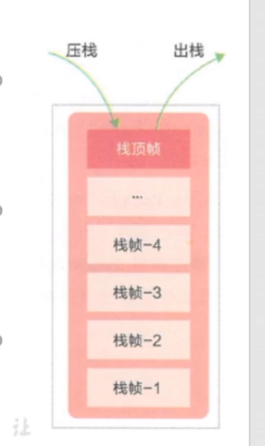

# 虚拟机栈

## 虚拟机栈概述

### 虚拟机栈出现的背景

​		由于跨平台性的设计，Java的指令都是根据栈来设计的。不同平台CPU架构不同，所以不能设计为基于寄存器的。

​		**优点：跨平台，指令集小（8位对齐），编译器容易实现**

​		**缺点：性能下降，实现同样的功能需要更多的指令**

​		有不少Java开发人员一提到Java内存结构，就会非常粗粒度的将JVM中的内存区理解为仅有Java堆（heap）和Java栈（stack）？为什么？（不全面。因为堆、栈比较重要，只记得这两个，C和C++中主体就是这两个 ）。

​		**栈是运行时单位，而堆是储存单位**

- 栈解决程序的运行问题。即程序如何运行，或者说如何处理数据。
- 堆解决的是数据存储的问题。即数据怎么放、放在哪。


### 虚拟机栈基本内容

#### Java虚拟机栈是什么？

Java虚拟机栈（Java Virtual Machine Stack），早期也叫Java栈。每个线程在创建时都会创建一个虚拟机栈，其内部保存一个个的栈帧（Stack Frame），对应着一次次的Java方法调用。

> 是线程私有的

代码：E:\github\Java\Java\JVM\jvm-demo\chapter05\src\main\java\cn\cq\jvm\StackTest.java


#### 生命周期

生命周期和线程一致

#### 作用

主管Java程序的运行，它保存方法的局部变量（8种基本数据类型、对象的引用地址）、部分结果，并参与方法的调用和返回。

> 局部变量 vs 成员变量（或属性）
>
> 基本数据类型变量 vs 引用类型变量（类、数组、接口）

#### 栈的特点（优点）FILO

- 栈是一种快速有效的分配存储方式，访问速度仅次于程序计数器。

- JVM直接对Java栈的操作只有两个：

  > 每个方法执行，伴随着进栈（入栈、压栈）
  >
  > 执行结束后的出栈操作

- 对于栈来说不存在垃圾回收问题（栈存在溢出的情况）

  > 不存在GC;存在OOM



#### 开发中遇到的异常有哪些？

##### 栈中可能出现的异常

- Java虚拟机规范允许**Java栈的大小是动态的或者是固定不变的**

  - 如果采用固定大小的Java虚拟机栈，那每一个线程的Java虚拟机栈容量可以在线程创建时独立选定。如果线程请求分配的栈容量超过Java虚拟机栈允许的最大容量，Java虚拟机会抛出一个**StackOverflowError**异常。

  演示：StackOverflowError

  代码：E:\github\Java\Java\JVM\jvm-demo\chapter05\src\main\java\cn\cq\jvm\StackErrorTest.java

  ```java
  /**
   * StackErrorTest <br>
   * 演示栈中异常:StackOverflowError
   * 默认情况下：cout：11412
   * 设置栈的大小：-Xss256k cout: 2468
   *
   * @author CQ <br>
   * @version 1.0 <br>
   * @date 2020-09-11 15:37 <br>
   */
  public class StackErrorTest {
      private static int cout = 1;
      public static void main(String[] args) {
          System.out.println(cout);
          cout++;
          main(args);
      }
  }
  ```

  

  - 如果Java虚拟机栈可以动态扩展，并且在尝试扩展的时候无法申请到足够的内存，或者在创建新的线程时没有足够的内存去创建对应的虚拟机栈，那Java虚拟机将会抛出一个**OutOfMemoryError**异常。

##### 设置栈内存大小

```java
  -Xss1m
  -Xss1k
```

 		我们可以使用参数 -Xss选项来设置线程的最大栈空间，栈的大小直接决定了函数调用的最大可达深度。

## 栈的存储单位

### 栈中存储什么？

- 每个线程都有自己的栈，栈中的数据都是以**栈帧（Stack Frame）**的格式存在
- 在这个线程上正在执行的每个方法都各自对应一个栈帧（Stack Frame）
- 栈帧是一个内存区域，是一个数据集，维系着方法执行过程中的各种数据信息

> OOP（面向对象）的基本概念：类、对象
>
> 类中基本结构：field（属性、字段、域）、method（方法）


### 栈运行原理

- JVM直接对Java栈的操作只有两个，就是对栈帧的**压栈**和**出栈**，遵循**先进后出，后进先出**的原则

- 在一条活动线程中，一个时间点上，只会有一个活动的栈帧。即当前正在执行的方法的栈帧（栈顶栈帧）是有效的，这个栈帧被称为**当前栈帧（Current Frame）**，与当前栈帧对应的方法就是**当前方法（Current Method）**，定义这个方法的类就是**当前类（Current Class）**。

- 执行引擎运行的所有字节码指令只针对当前栈帧进行操作

- 如果在该方法中调用了其他方法，对应的新的栈帧会被创建出来，放在栈的顶端，成为新的当前栈帧。

  

举例：栈帧调用举例

代码：E:\github\Java\Java\JVM\jvm-demo\chapter05\src\main\java\cn\cq\jvm\StackFrameTest.java

```java
/**
 * StackFrameTest <br>
 *
 * @author CQ <br>
 * @version 1.0 <br>
 * @date 2020-09-14 20:05 <br>
 */
public class StackFrameTest {
    public static void main(String[] args) {
        method01();
    }

    private static int method01() {
        System.out.println("方法1的开始");
        int i = method02();
        System.out.println("方法1的结束");
        return i;
    }

    private static int method02() {
        System.out.println("方法2的开始");
        int i = method03();;
        System.out.println("方法2的结束");
        return i;
    }
    private static int method03() {
        System.out.println("方法3的开始");
        int i = 30;
        System.out.println("方法3的结束");
        return i;
    }
}
```

idea断点观察栈帧


- 不同线程所包含的栈帧是不允许存在相互调用的，即不可能在一个栈帧之中引用另外一个线程的栈帧。（栈帧都是独立的）
- 如果当前方法调用了其他方法，方法返回之际，当前栈帧会传回此方法的执行结果给前一个栈帧，接着，虚拟机会丢弃当前栈帧使得前一个栈帧重新成为当前栈帧。
- Java方法有两种返回函数的方式，**一种是正常的函数返回，使用return指令；另外一种是抛出异常，不管使用那种方式，都会导致栈帧被弹出**

### 栈帧内部结构

每个栈帧中存储着：

- **局部变量表（Local Variables）**

- **操作数栈（Operand Stack）（或表达式栈）**

- 动态链接（Dynamic Linking）（或指向运行时常量池的方法引用）

- 方法返回地址（Return Address）（或方法正常退出或异常退出的定义）

- 一些附加信息

  

  ​		

  **栈帧的大小主要由局部变量表 和 操作数栈决定的**

  ​		并行每个线程下的栈都是私有的，因此每个线程都有自己各自的栈，并且每个栈里面都有很多栈帧


## 局部变量表

- 局部变量表也被称之为局部变量数组或本地变量表

- **定义为一个数字数组，主要用于存储方法参数和定义在方法体内的局部变量**，这些数据类型包括各种基本数据类型、对象引用（reference），以及returnAddress类型

- 由于局部变量表是建立在线程的栈上，是线程的私有数据，因此不存在**数据安全性问题**（指多个线程操作某个共享数据引发的安全性问题）

- **局部变量表所需的容量大小是在编译期确定下来的**，并保存在方法的Code属性的maximum local variables数据项中。在方法运行期间是不会改变局部变量表大小的。

  

- **方法嵌套调用的次数由栈大小决定**。一般来说，**栈越大，方法嵌套调用次数越多**。对一个函数而言，它的参数和局部变量越多，使得局部变量表膨胀，它的栈帧就越大，以满足方法调用所需传递的信息增大的需求。进而函数调用就会占用更多的栈空间，导致其嵌套调用的次数就会减少。

- **局部变量表中的变量只在当前方法调用中有效**。在方法执行时，虚拟机通过使用局部变量表完成参数值到参数变量列表的传递过程。**当方法调用结束后，随着方法栈的销毁，局部变量表也会随之下销毁**。

  举例：字节码查看

  代码：E:\github\Java\Java\JVM\jvm-demo\chapter05\src\main\java\cn\cq\jvm\LocalVariablesTest.java

  ```java
  /**
   * LocalVariablesTest <br>
   *
   * @author CQ <br>
   * @version 1.0 <br>
   * @date 2020-09-15 20:11 <br>
   */
  public class LocalVariablesTest {
      private int cout = 0;
  
      public static void main(String[] args) {
          LocalVariablesTest test =new LocalVariablesTest();
          int num = 10;
          test.test1();
      }
  
      public static void testStatic(){
          LocalVariablesTest test = new LocalVariablesTest();
          Date date = new Date();
          int cout = 10;
          System.out.println(cout);
      }
  
      private void test1() {
      }
  }
  
  ```

  main方法：

  

  

  

  对应作用域Stack Pc到Lenth，加起来等于方法总作用域

  


## 操作数栈

## 代码追踪

## 栈顶缓存技术

## 动态链接

## 方法的调用：解析与分派

## 方法返回地址

## 一些附加信息

## 栈的相关面试题