# 堆

## 1.堆的核心概述

### 1.1核心概述

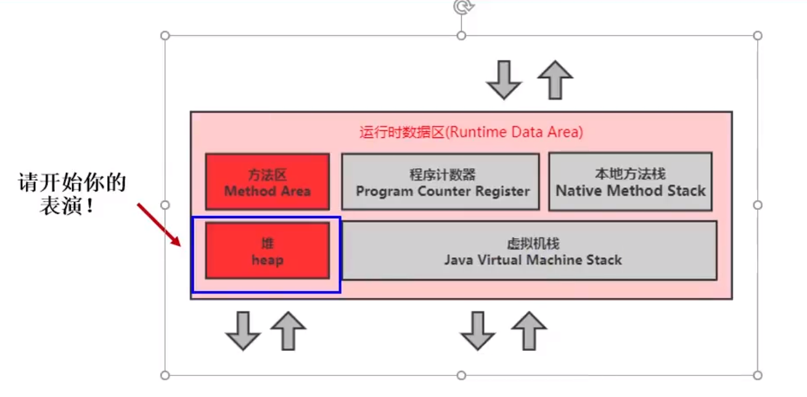

- 一个JVM实例只存在一个堆内存，堆也是Java内存管理的核心区域

- Java堆区在JVM启动的时候即被创建，其空间大小也就确定了。是JVM管理的最大一块内存空间。

  > 堆内存的大小是可以调节的

  举例：

  ```java
  /**
   * HeapDemo <br>
   *     -Xms10m -Xmx10m
   *E:\github\Java\Java\JVM\jvm-demo\chapter08\src\main\java\cn\cq\jvm\HeapDemo.java
   * @author CQ <br>
   * @version 1.0 <br>
   * @date 2020-09-25 15:42 <br>
   */
  public class HeapDemo {
      public static void main(String[] args) {
          System.out.println("start...");
          try {
              Thread.sleep(1000000);
          } catch (InterruptedException e) {
              e.printStackTrace();
          }
          System.out.println("end...");
      }
  }
  ```

  ```java
  /**
   * HeapDemo <br>
   *   -Xms20m -Xmx20m
   *E:\github\Java\Java\JVM\jvm-demo\chapter08\src\main\java\cn\cq\jvm\HeapDemo1.java
   * @author CQ <br>
   * @version 1.0 <br>
   * @date 2020-09-25 15:42 <br>
   */
  public class HeapDemo1 {
      public static void main(String[] args) {
          System.out.println("start...");
          try {
              Thread.sleep(1000000);
          } catch (InterruptedException e) {
              e.printStackTrace();
          }
          System.out.println("end...");
      }
  }
  ```

  查看VisualVM中GC情况，总和为jvm内存大小（安装插件VisualGC）

  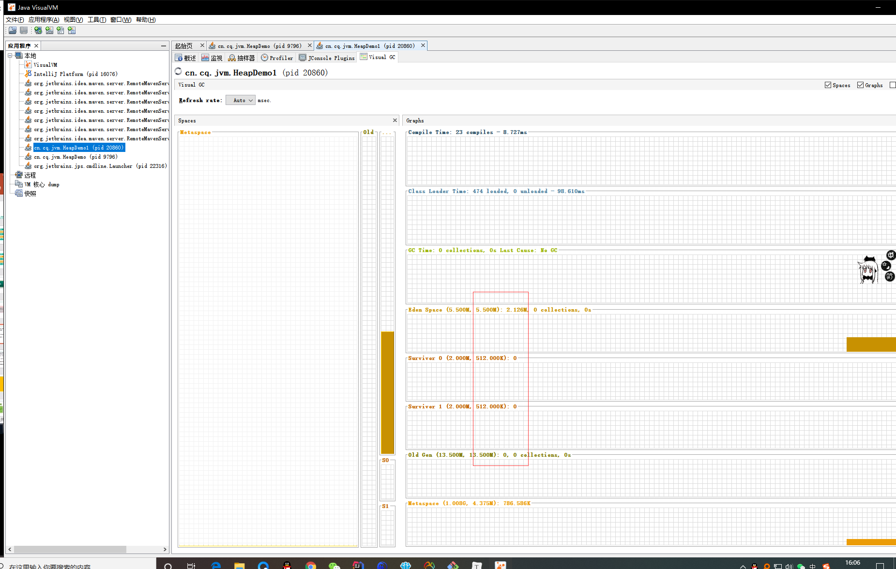

  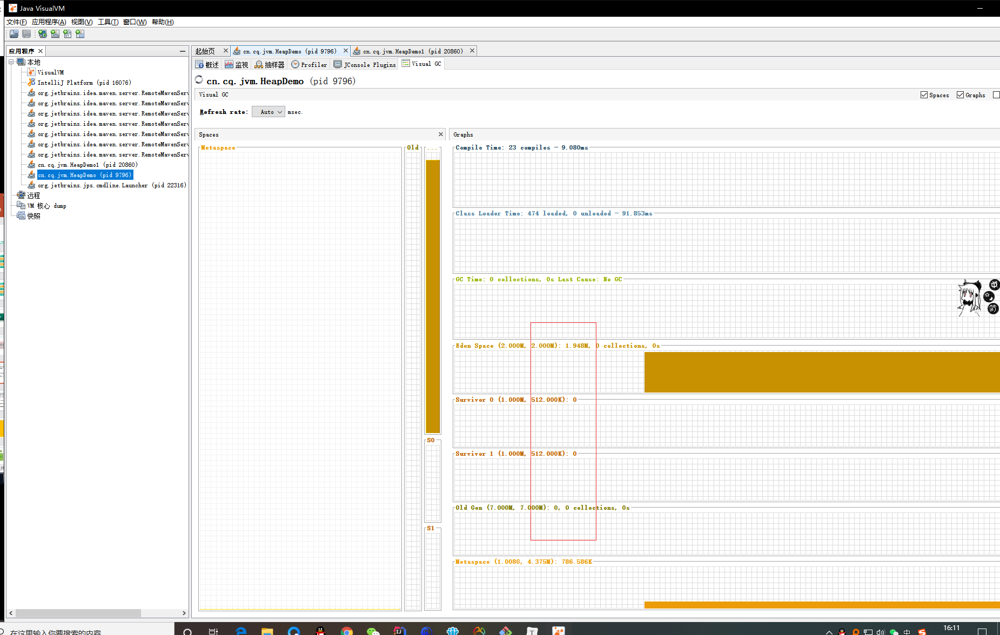

- 《Java虚拟机规范》规定，堆可以处于**物理上不连续**的内存空间中，但是在**逻辑上**它应该被视为**连续的**（物理上可以存储在不同的区域，但是逻辑上为了读取速度和性能应该在虚拟机层面进行映射，保证连续）

- 所有的线程共享Java堆，在这里还可以划分线程私有的缓冲区（Threa Local Allocation Buffer，TLAB）（解决并发情况下性能问题，在共享的堆空间中分配一小块地址，每个线程私有一块）

- 《Java虚拟机规范》中对Java堆的描述是：**所有的**对象实例以及数组都应该在运行时分配在堆上。（The heap is the run-time data area from which memory for all class instances and arrays is allocated）

  > 我要说的是：**几乎**所有的对象实例都在这里分配内存。——从实际使用角度看（逃逸分析，可以分配在栈上）

- 数组和对象可能永远不会存储在栈上，因为栈帧中保存引用，这个引用指向对象或数组在堆中的位置

  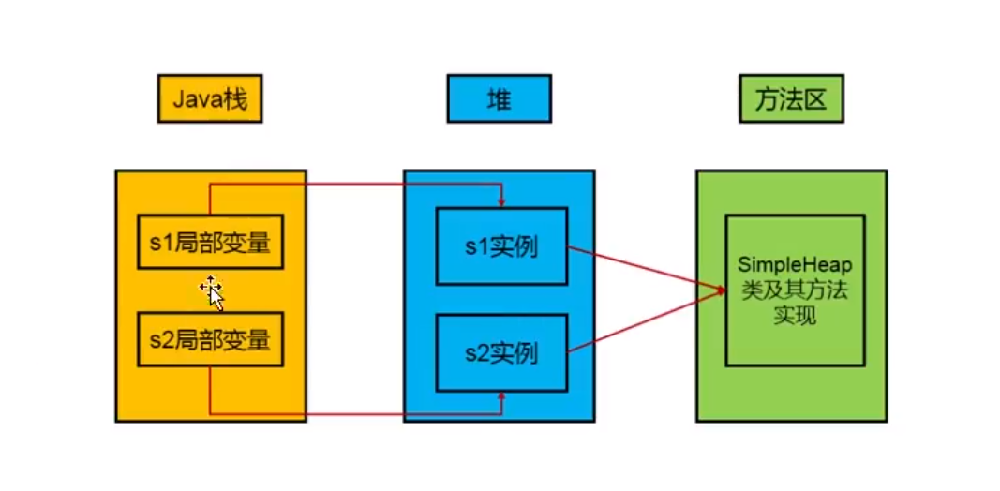

  举例：

  ```java
  /**
   * SimpleHeap <br>
   *	E:\github\Java\Java\JVM\jvm-demo\chapter08\src\main\java\cn\cq\jvm\SimpleHeap.java
   * @author CQ <br>
   * @version 1.0 <br>
   * @date 2020-09-25 16:32 <br>
   */
  public class SimpleHeap {
      private int id;
  
      public SimpleHeap(int id) {
          this.id = id;
      }
  
      public void show() {
          System.out.println("My ID is " + id);
      }
  
      public static void main(String[] args) {
          SimpleHeap s1 = new SimpleHeap(1);
          SimpleHeap s2 = new SimpleHeap(2);
  
          int[] arr = new int[10];
          Object[] arr1 = new Object[10];
      }
  }
  ```

  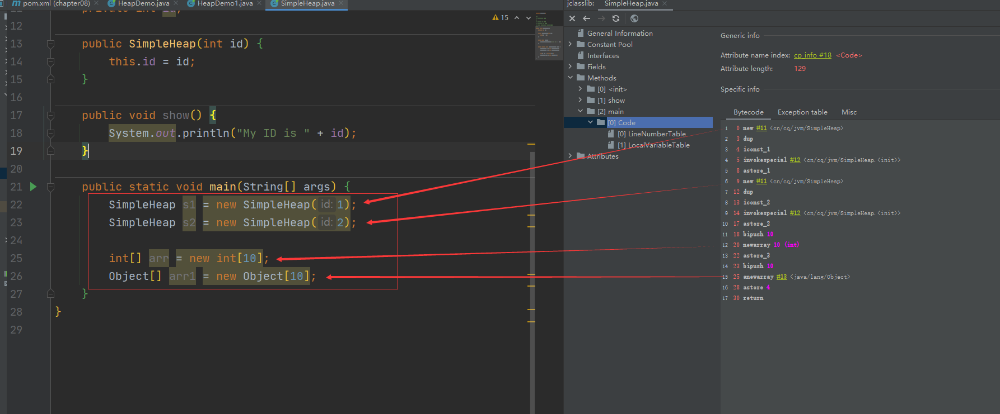

- 在方法结束后，堆中的对象不会立马被移除，仅仅在垃圾收集的时候才会被移除

- 堆，是GC（Garbage Collection，垃圾收集器）执行垃圾回收的重点区域

### 1.2内存细分

**现代垃圾收集器大部分都基于分代收集理论设计，堆空间细分为：**

- Java7及以前堆内存**逻辑上**分为三部分：**新生区+养老区+*<u>永久区</u>***

  - Young Generation Space		新生区		Young/New
    - 又被划分为Eden区和Survivor区
  - Tenure generation space        养老区		Old/Tenure
  - Permanent Space				 	永久区		Perm

- Java8及以后堆内存**逻辑上**分为三部分：**新生区+养老区+<u>*元空间*</u> **

  - Young Generation Space		新生区		Young/New
    - 又被划分为Eden区和Survivor区
  - Tenure generation space        养老区		Old/Tenure
  - Meta Space				            	元空间		Meta

  > 约定：新生区=新生代=年轻代
  >
  > ​           养老区=老年区=老年代
  >
  > ​           永久区=永久代

- 堆空间内部结构（JDK7）

  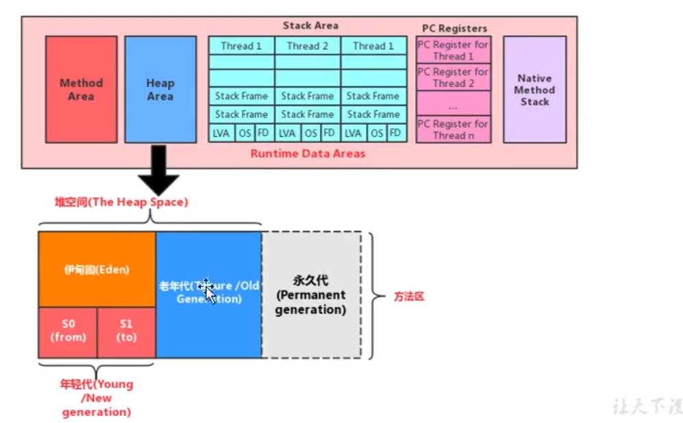

- 堆空间内部结构（JDK8）

  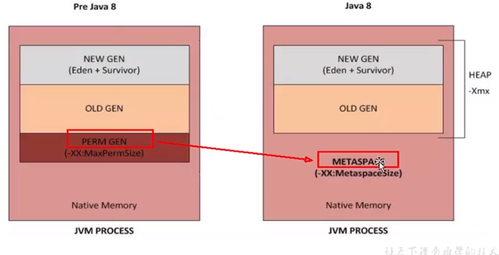

JDK8中内存结构有哪些变化：堆空间中永久代变为元空间

## 2.设置堆内存大小与OOM

### 2.1设置堆内存大小

- Java堆区用于存储Java对象实例，那么堆的大小在JVM启动的时候就已经设定好了，通过选项-Xms，-Xmx来进行设置

  >-Xms用于表示堆区的起始内存，等价于-XX:InitialHeapSize
  >
  >-Xmx用于表示堆区的最大内存，等价于-XX:MaxHeapSize

- 一旦堆区中的内存大小超过-Xmx所指定的最大内存时，将会抛出OutOfMemoryError异常

- 通常会将-Xms和-Xmx两个参数配置相同的值，其**目的就是为了能够在java垃圾回收机制清理完堆区后不需要重新分割计算堆区的大小，从而提高性能**。（GC之后一些空间被释放，两个参数不同时，多出来的部分会退还给系统，下次再次需要扩容空间时，有需要继续计算重新分割，影响性能）

- 默认情况下，初始内存大小：物理电脑内存 / 64

  ​						最大内存大小：物理电脑内存 / 4

- 查看设置的参数：方式一：jps / jstat -gc 进程id

  ​							  方式二：-XX:+PrintGCDetails

举例：

```java
/**
 * E:\github\Java\Java\JVM\jvm-demo\chapter08\src\main\java\cn\cq\jvm\HeapSpaceInitial.java
 * HeapSpaceInitial <br>
 *     1. 设置堆空间大小的参数
 *          -Xms 用来设置堆空间（年轻代+老年代）的初始内存大小
 *              -X 是jvm的运行参数
 *              ms 是memory start
 *          -Xmx 用来设置堆空间（年轻代+老年代）的最大内存大小
 *     2. 默认堆空间的大小
 *          初始内存大小：物理电脑内存大小 / 64
 *          最大内存大小：物理电脑内存大小 / 4
 *     3. 手动设置：-Xms600m -Xmx600m
 *          开发中建议将初始堆内存和最大堆内存设置成相同的值
 *     4. 查看设置的参数： 方式一： jps /   jstat -gc 进程id
 *                      方式二： -XX:+PrintGCDetails
 *
 *
 * @author CQ <br>
 * @version 1.0 <br>
 * @date 2020-09-27 13:43 <br>
 */
public class HeapSpaceInitial {
    public static void main(String[] args) {
        //返回Java虚拟机中堆内存总量
        long initialMemory = Runtime.getRuntime().totalMemory() / 1024 / 1024;
        //返回Java虚拟机试图使用的最大堆内存量
        long maxMemory = Runtime.getRuntime().maxMemory() / 1024 / 1024;

        System.out.println("-Xms: "+initialMemory+"M");
        System.out.println("-Xmx: "+maxMemory+"M");

        /*System.out.println("系统内存大小为："+initialMemory*64.0/1024+"G");
        System.out.println("系统内存大小为："+maxMemory*4.0/1024+"G");
        */
        /*try {
            Thread.sleep(1000000);
        } catch (InterruptedException e) {
            e.printStackTrace();
        }*/
    }
}
```


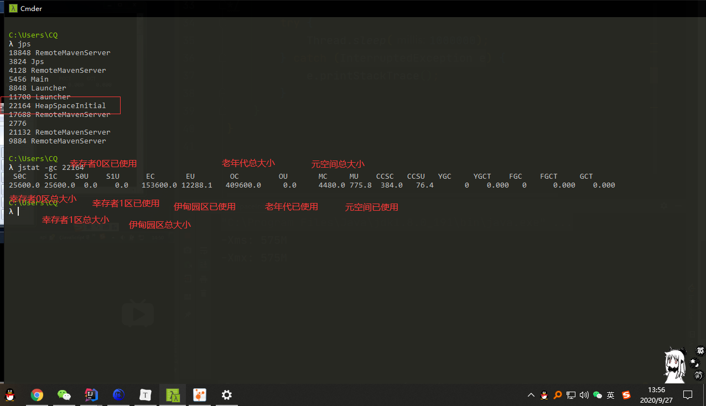

在代码中，计算结果不等于设置的600m，是因为s0区和s1区在进行计算的时候，只使用了一个

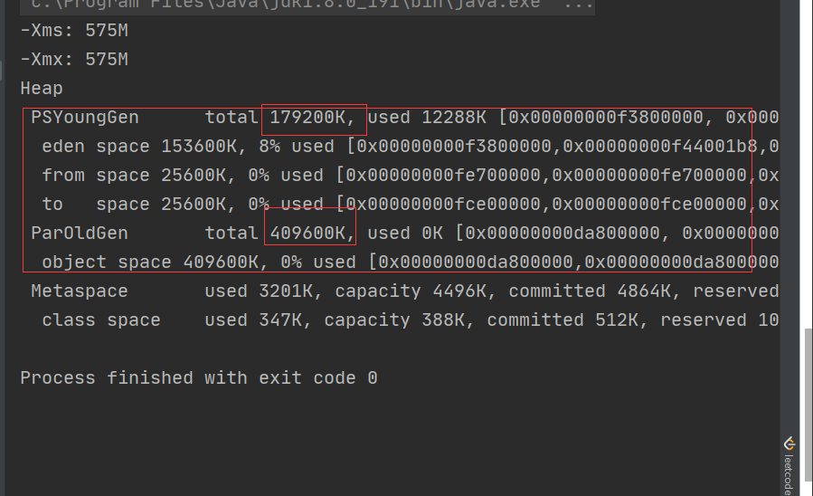

### 2.2OutOfMemory举例

- 举例演示：Exception in thread "main" java.lang.OutOfMemoryError: Java heap space

  ```java
  /**
   * OOMTest <br>
   *     -Xms600m -Xmx600m
   *
   * @author CQ <br>
   * @version 1.0 <br>
   * @date 2020-09-27 14:19 <br>
   */
  public class OOMTest {
      public static void main(String[] args) {
          ArrayList<Picture> list = new ArrayList<Picture>();
          while (true) {
              try {
                  Thread.sleep(20);
              } catch (InterruptedException e) {
                  e.printStackTrace();
              }
              list.add(new Picture(new Random().nextInt(1024 * 1024)));
          }
      }
  }
  
  class Picture {
      private byte[] pixels;
  
      public Picture(int length) {
          this.pixels = new byte[length];
      }
  }
  ```

  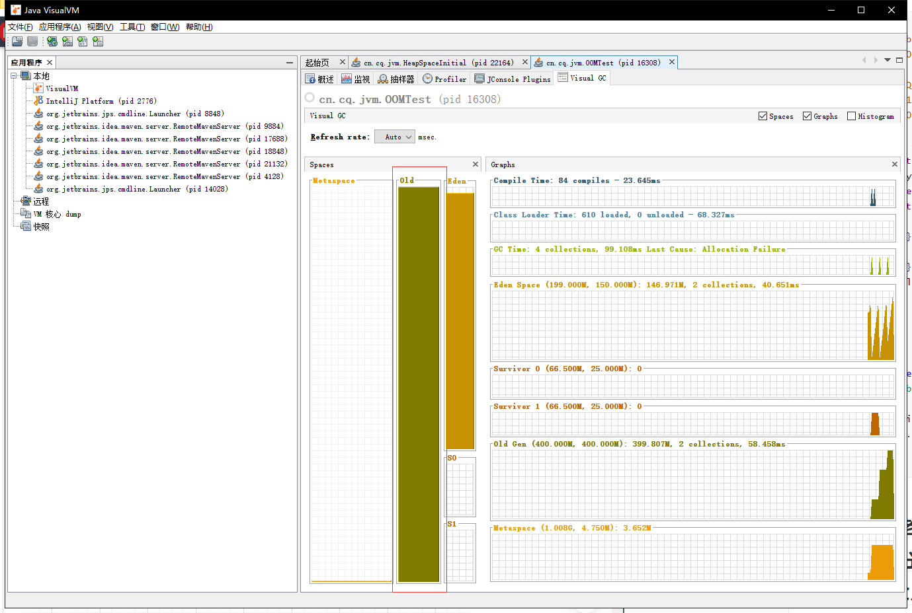

## 3.年轻代与老年代

- 存储在JVM中的Java对象可以被划分为两类：

  - 生命周期较短的瞬时对象，这类对象的创建和消亡都非常迅速
  - 生命周期非常长，在某些极端的情况下能够与JVM的生命周期保持一致（比如连接类对象，可以在每次GC时，避免对这些对象进行检测，提高性能）

  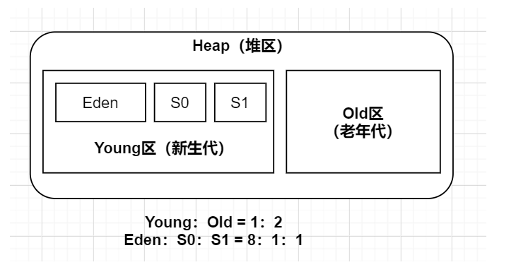

- Java堆区进一步细分的话，可以划分为年轻代（YoungGen）和老年代（OldGen）

- 其中年轻代又可以划分为Eden空间、Survivor0空间和Survivor1空间（有时也叫作from区和to区）

  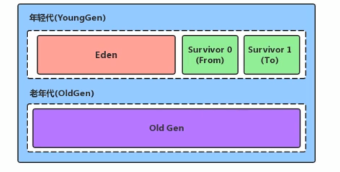

下面这参数开发中一般不会调：

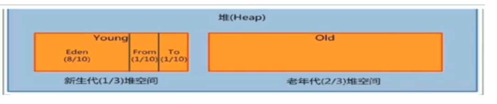

- 配置新生代与老年代在堆结构的占比

  > 默认-XX:NewRatio=2，表示新生代占1，老年代占2，新生代与老年代比例为2，新生代占整个堆的1/3
  >
  > 可以修改-XX:NewRatio=4，表示新生代占1，老年代占4，新生代占整个堆的1/5

  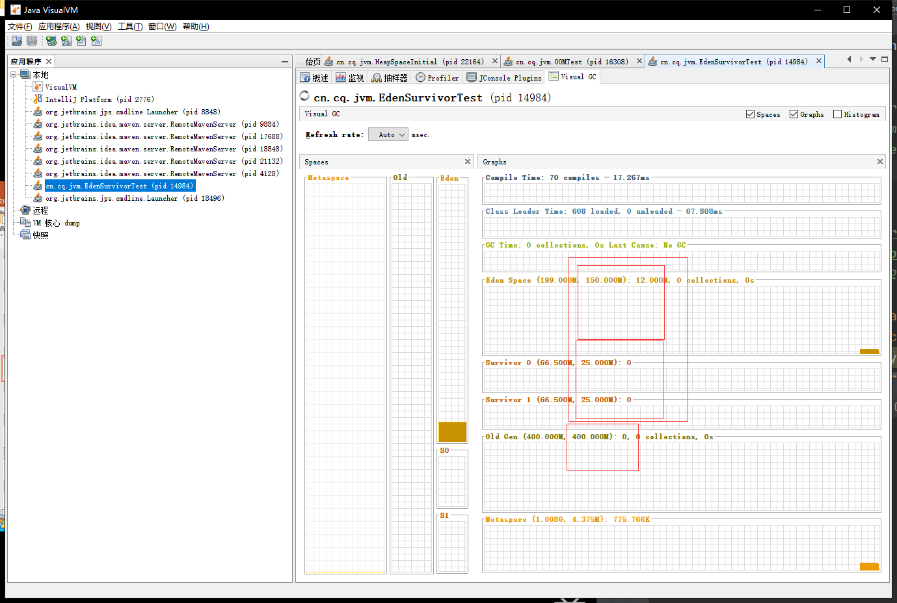

  如果明确知道老年代中对象偏多，可以调整老年代大小

  查看运行参数jinfo -flag newRatio 进程id

  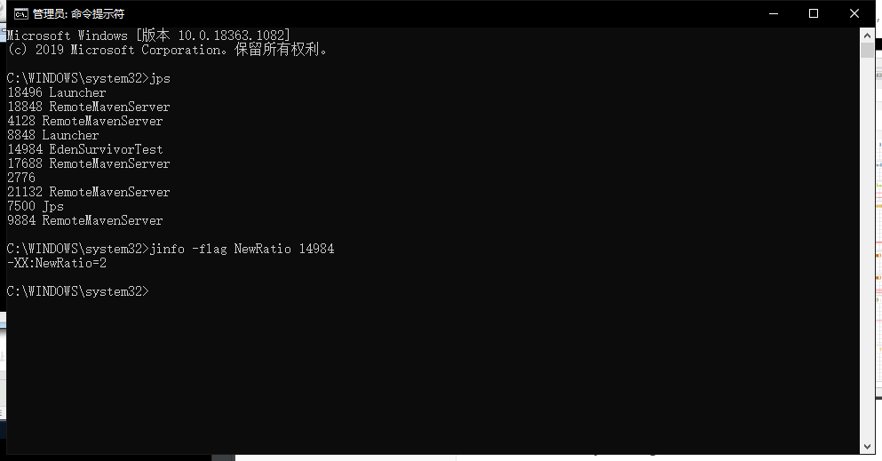

- 在HotSpot中，Eden空间和另外两个Survivor空间缺省所占的比例是8:1:1

- 当然开发人员可以通过选项-XX:SurvivorRatio调整这个空间比例。比如-XX:SurvivorRatio=8

- **几乎所有的**Java对象都是在Eden区被new出来的

- 绝大部分的Java对象的销毁都在新生代进行

  > IBM公司的专门研究表明，新生代中80%的对象都是朝生夕死

- 可以使用选项-Xmn设置新生代最大内存大小

  > 这个参数一般使用默认值就可以了
  >
  > 设置了-Xmn的情况下-XX:NewRatio会失效

默认情况下，我们看到的并不是8:1:1，而是6:1:1，涉及到自适应内存分配策略，可以直接设置-XX:SurvivorRatio=8

-XX:NewRatio: 设置新生代与老年代的比例，默认值为2

-XX:SurvivorRatio：设置新生代中中Eden区和Survivor区的比例

-XX:-UseAdaptiveSizePolicy：关闭自适应的内存分配策略

-Xmn：设置新生代空间大小


举例：

```java
/**
E:\github\Java\Java\JVM\jvm-demo\chapter08\src\main\java\cn\cq\jvm\EdenSurvivorTest.java
 * EdenSurvivorTest <br>
 *     -Xms600m -Xmx600m
 *     -NewRatio:设置新生代与老年代的比例。默认值是2。
 *               当前即为，新生代200m+老年代200*2=400m=600m
 *     -XX:SurvivorRatio：设置新生代中中Eden区和Survivor区的比例
 *     -XX:-UseAdaptiveSizePolicy：关闭自适应的内存分配策略
 *     -Xmn：设置新生代空间大小
 *
 *
 * @author CQ <br>
 * @version 1.0 <br>
 * @date 2020-09-27 14:37 <br>
 */
public class EdenSurvivorTest {
    public static void main(String[] args) {
        System.out.println("-----------");
        try {
            Thread.sleep(1000000);
        } catch (InterruptedException e) {
            e.printStackTrace();
        }
    }
}
```

## 4.图解对象分配过程

### 4.1对象分配过程：概述

为新对象分配内存是一件非常严谨和复杂的任务，JVM的设计者们不仅需要考虑内存如何分配、在哪里分配等问题，并且由于内存分配算法与内存回收算法密切相关，所以还需要考虑GC执行完内存回收后是否会在内存空间中产生内存碎片。

1. new的对象先放伊甸园区。此区有大小限制。

2. 当伊甸园区的空间填满时，程序又需要创建对象，JVM的垃圾回收器对伊甸园区进行垃圾回收（Minor GC），将伊甸园区中不再被其他对象所引用的对象进行销毁。在加载新的对象放到伊甸园区

3. 然后将伊甸园区中剩余对象移动到幸存者0区

4. 如果再次触发垃圾回收，此时上次幸存下来的存放到幸存者0区的，如果没有回收，就会放到幸存者1区

5. 如果再次经历垃圾回收，此时会重新返回幸存者0区，接着再去幸存者1区

6. 啥时候能去养老区呢？可以设置次数。默认是15次

   - 可以设置的参数：-XX:MaxTenuringThreshold=<N>进行设置

7. 在养老区，相对悠闲。当养老区内存不足时，再次触发GC：Major GC，进行养老区的内存清理

8. 若养老区执行了Major GC之后发现依然无法进行对象的保存，就会产生OOM异常

   java.lang.OutOfMemoryError:Java heap space

### 4.2对象分配过程：图解

### 4.3对象分配过程：小结


## 5.Minor GC、Major GC、Full GC

## 6.堆空间分代思想

## 7.内存分配策略

## 8.为对象分配内存：TLAB

## 9.小结堆空间的参数设置

## 10.堆是分配对象的唯一选择吗？


