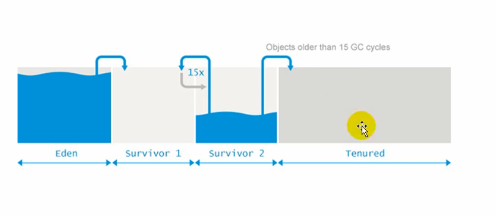

# 堆

## 1.堆的核心概述

### 1.1核心概述


- 一个JVM实例只存在一个堆内存，堆也是Java内存管理的核心区域

- Java堆区在JVM启动的时候即被创建，其空间大小也就确定了。是JVM管理的最大一块内存空间。

  > 堆内存的大小是可以调节的

  举例：

  ```java
  /**
   * HeapDemo <br>
   *     -Xms10m -Xmx10m
   *E:\github\Java\Java\JVM\jvm-demo\chapter08\src\main\java\cn\cq\jvm\HeapDemo.java
   * @author CQ <br>
   * @version 1.0 <br>
   * @date 2020-09-25 15:42 <br>
   */
  public class HeapDemo {
      public static void main(String[] args) {
          System.out.println("start...");
          try {
              Thread.sleep(1000000);
          } catch (InterruptedException e) {
              e.printStackTrace();
          }
          System.out.println("end...");
      }
  }
  ```

  ```java
  /**
   * HeapDemo <br>
   *   -Xms20m -Xmx20m
   *E:\github\Java\Java\JVM\jvm-demo\chapter08\src\main\java\cn\cq\jvm\HeapDemo1.java
   * @author CQ <br>
   * @version 1.0 <br>
   * @date 2020-09-25 15:42 <br>
   */
  public class HeapDemo1 {
      public static void main(String[] args) {
          System.out.println("start...");
          try {
              Thread.sleep(1000000);
          } catch (InterruptedException e) {
              e.printStackTrace();
          }
          System.out.println("end...");
      }
  }
  ```

  查看VisualVM中GC情况，总和为jvm内存大小（安装插件VisualGC）

  

  

- 《Java虚拟机规范》规定，堆可以处于**物理上不连续**的内存空间中，但是在**逻辑上**它应该被视为**连续的**（物理上可以存储在不同的区域，但是逻辑上为了读取速度和性能应该在虚拟机层面进行映射，保证连续）

- 所有的线程共享Java堆，在这里还可以划分线程私有的缓冲区（Threa Local Allocation Buffer，TLAB）（解决并发情况下性能问题，在共享的堆空间中分配一小块地址，每个线程私有一块）

- 《Java虚拟机规范》中对Java堆的描述是：**所有的**对象实例以及数组都应该在运行时分配在堆上。（The heap is the run-time data area from which memory for all class instances and arrays is allocated）

  > 我要说的是：**几乎**所有的对象实例都在这里分配内存。——从实际使用角度看（逃逸分析，可以分配在栈上）

- 数组和对象可能永远不会存储在栈上，因为栈帧中保存引用，这个引用指向对象或数组在堆中的位置

  

  举例：

  ```java
  /**
   * SimpleHeap <br>
   *	E:\github\Java\Java\JVM\jvm-demo\chapter08\src\main\java\cn\cq\jvm\SimpleHeap.java
   * @author CQ <br>
   * @version 1.0 <br>
   * @date 2020-09-25 16:32 <br>
   */
  public class SimpleHeap {
      private int id;
  
      public SimpleHeap(int id) {
          this.id = id;
      }
  
      public void show() {
          System.out.println("My ID is " + id);
      }
  
      public static void main(String[] args) {
          SimpleHeap s1 = new SimpleHeap(1);
          SimpleHeap s2 = new SimpleHeap(2);
  
          int[] arr = new int[10];
          Object[] arr1 = new Object[10];
      }
  }
  ```

  

- 在方法结束后，堆中的对象不会立马被移除，仅仅在垃圾收集的时候才会被移除

- 堆，是GC（Garbage Collection，垃圾收集器）执行垃圾回收的重点区域

### 1.2内存细分

**现代垃圾收集器大部分都基于分代收集理论设计，堆空间细分为：**

- Java7及以前堆内存**逻辑上**分为三部分：**新生区+养老区+*<u>永久区</u>***

  - Young Generation Space		新生区		Young/New
    - 又被划分为Eden区和Survivor区
  - Tenure generation space        养老区		Old/Tenure
  - Permanent Space				 	永久区		Perm

- Java8及以后堆内存**逻辑上**分为三部分：**新生区+养老区+<u>*元空间*</u> **

  - Young Generation Space		新生区		Young/New
    - 又被划分为Eden区和Survivor区
  - Tenure generation space        养老区		Old/Tenure
  - Meta Space				            	元空间		Meta

  > 约定：新生区=新生代=年轻代
  >
  > ​           养老区=老年区=老年代
  >
  > ​           永久区=永久代

- 堆空间内部结构（JDK7）

  

- 堆空间内部结构（JDK8）

  

JDK8中内存结构有哪些变化：堆空间中永久代变为元空间

## 2.设置堆内存大小与OOM

### 2.1设置堆内存大小

- Java堆区用于存储Java对象实例，那么堆的大小在JVM启动的时候就已经设定好了，通过选项-Xms，-Xmx来进行设置

  >-Xms用于表示堆区的起始内存，等价于-XX:InitialHeapSize
  >
  >-Xmx用于表示堆区的最大内存，等价于-XX:MaxHeapSize

- 一旦堆区中的内存大小超过-Xmx所指定的最大内存时，将会抛出OutOfMemoryError异常

- 通常会将-Xms和-Xmx两个参数配置相同的值，其**目的就是为了能够在java垃圾回收机制清理完堆区后不需要重新分割计算堆区的大小，从而提高性能**。（GC之后一些空间被释放，两个参数不同时，多出来的部分会退还给系统，下次再次需要扩容空间时，有需要继续计算重新分割，影响性能）

- 默认情况下，初始内存大小：物理电脑内存 / 64

  ​						最大内存大小：物理电脑内存 / 4

- 查看设置的参数：方式一：jps / jstat -gc 进程id

  ​							  方式二：-XX:+PrintGCDetails

举例：

```java
/**
 * E:\github\Java\Java\JVM\jvm-demo\chapter08\src\main\java\cn\cq\jvm\HeapSpaceInitial.java
 * HeapSpaceInitial <br>
 *     1. 设置堆空间大小的参数
 *          -Xms 用来设置堆空间（年轻代+老年代）的初始内存大小
 *              -X 是jvm的运行参数
 *              ms 是memory start
 *          -Xmx 用来设置堆空间（年轻代+老年代）的最大内存大小
 *     2. 默认堆空间的大小
 *          初始内存大小：物理电脑内存大小 / 64
 *          最大内存大小：物理电脑内存大小 / 4
 *     3. 手动设置：-Xms600m -Xmx600m
 *          开发中建议将初始堆内存和最大堆内存设置成相同的值
 *     4. 查看设置的参数： 方式一： jps /   jstat -gc 进程id
 *                      方式二： -XX:+PrintGCDetails
 *
 *
 * @author CQ <br>
 * @version 1.0 <br>
 * @date 2020-09-27 13:43 <br>
 */
public class HeapSpaceInitial {
    public static void main(String[] args) {
        //返回Java虚拟机中堆内存总量
        long initialMemory = Runtime.getRuntime().totalMemory() / 1024 / 1024;
        //返回Java虚拟机试图使用的最大堆内存量
        long maxMemory = Runtime.getRuntime().maxMemory() / 1024 / 1024;

        System.out.println("-Xms: "+initialMemory+"M");
        System.out.println("-Xmx: "+maxMemory+"M");

        /*System.out.println("系统内存大小为："+initialMemory*64.0/1024+"G");
        System.out.println("系统内存大小为："+maxMemory*4.0/1024+"G");
        */
        /*try {
            Thread.sleep(1000000);
        } catch (InterruptedException e) {
            e.printStackTrace();
        }*/
    }
}
```


在代码中，计算结果不等于设置的600m，是因为s0区和s1区在进行计算的时候，只使用了一个


### 2.2OutOfMemory举例

- 举例演示：Exception in thread "main" java.lang.OutOfMemoryError: Java heap space

  ```java
  /**
   * OOMTest <br>
   *     -Xms600m -Xmx600m
   *
   * @author CQ <br>
   * @version 1.0 <br>
   * @date 2020-09-27 14:19 <br>
   */
  public class OOMTest {
      public static void main(String[] args) {
          ArrayList<Picture> list = new ArrayList<Picture>();
          while (true) {
              try {
                  Thread.sleep(20);
              } catch (InterruptedException e) {
                  e.printStackTrace();
              }
              list.add(new Picture(new Random().nextInt(1024 * 1024)));
          }
      }
  }
  
  class Picture {
      private byte[] pixels;
  
      public Picture(int length) {
          this.pixels = new byte[length];
      }
  }
  ```

  

## 3.年轻代与老年代

- 存储在JVM中的Java对象可以被划分为两类：

  - 生命周期较短的瞬时对象，这类对象的创建和消亡都非常迅速
  - 生命周期非常长，在某些极端的情况下能够与JVM的生命周期保持一致（比如连接类对象，可以在每次GC时，避免对这些对象进行检测，提高性能）

  

- Java堆区进一步细分的话，可以划分为年轻代（YoungGen）和老年代（OldGen）

- 其中年轻代又可以划分为Eden空间、Survivor0空间和Survivor1空间（有时也叫作from区和to区）

  

下面这参数开发中一般不会调：


- 配置新生代与老年代在堆结构的占比

  > 默认-XX:NewRatio=2，表示新生代占1，老年代占2，新生代与老年代比例为2，新生代占整个堆的1/3
  >
  > 可以修改-XX:NewRatio=4，表示新生代占1，老年代占4，新生代占整个堆的1/5

  

  如果明确知道老年代中对象偏多，可以调整老年代大小

  查看运行参数jinfo -flag newRatio 进程id

  

- 在HotSpot中，Eden空间和另外两个Survivor空间缺省所占的比例是8:1:1

- 当然开发人员可以通过选项-XX:SurvivorRatio调整这个空间比例。比如-XX:SurvivorRatio=8

- **几乎所有的**Java对象都是在Eden区被new出来的

- 绝大部分的Java对象的销毁都在新生代进行

  > IBM公司的专门研究表明，新生代中80%的对象都是朝生夕死

- 可以使用选项-Xmn设置新生代最大内存大小

  > 这个参数一般使用默认值就可以了
  >
  > 设置了-Xmn的情况下-XX:NewRatio会失效

默认情况下，我们看到的并不是8:1:1，而是6:1:1，涉及到自适应内存分配策略，可以直接设置-XX:SurvivorRatio=8

-XX:NewRatio: 设置新生代与老年代的比例，默认值为2

-XX:SurvivorRatio：设置新生代中中Eden区和Survivor区的比例

-XX:-UseAdaptiveSizePolicy：关闭自适应的内存分配策略

-Xmn：设置新生代空间大小



举例：

```java
/**
E:\github\Java\Java\JVM\jvm-demo\chapter08\src\main\java\cn\cq\jvm\EdenSurvivorTest.java
 * EdenSurvivorTest <br>
 *     -Xms600m -Xmx600m
 *     -NewRatio:设置新生代与老年代的比例。默认值是2。
 *               当前即为，新生代200m+老年代200*2=400m=600m
 *     -XX:SurvivorRatio：设置新生代中中Eden区和Survivor区的比例
 *     -XX:-UseAdaptiveSizePolicy：关闭自适应的内存分配策略
 *     -Xmn：设置新生代空间大小
 *
 *
 * @author CQ <br>
 * @version 1.0 <br>
 * @date 2020-09-27 14:37 <br>
 */
public class EdenSurvivorTest {
    public static void main(String[] args) {
        System.out.println("-----------");
        try {
            Thread.sleep(1000000);
        } catch (InterruptedException e) {
            e.printStackTrace();
        }
    }
}
```

## 4.图解对象分配过程

### 4.1对象分配过程：概述

为新对象分配内存是一件非常严谨和复杂的任务，JVM的设计者们不仅需要考虑内存如何分配、在哪里分配等问题，并且由于内存分配算法与内存回收算法密切相关，所以还需要考虑GC执行完内存回收后是否会在内存空间中产生内存碎片。

1. new的对象先放伊甸园区。此区有大小限制。

2. 当伊甸园区的空间填满时，程序又需要创建对象，JVM的垃圾回收器对伊甸园区进行垃圾回收（Minor GC），将伊甸园区中不再被其他对象所引用的对象进行销毁。在加载新的对象放到伊甸园区

3. 然后将伊甸园区中剩余对象移动到幸存者0区

4. 如果再次触发垃圾回收，此时上次幸存下来的存放到幸存者0区的，如果没有回收，就会放到幸存者1区

5. 如果再次经历垃圾回收，此时会重新返回幸存者0区，接着再去幸存者1区

6. 啥时候能去养老区呢？可以设置次数。默认是15次

   - 可以设置的参数：-XX:MaxTenuringThreshold=<N>进行设置

7. 在养老区，相对悠闲。当养老区内存不足时，再次触发GC：Major GC，进行养老区的内存清理

8. 若养老区执行了Major GC之后发现依然无法进行对象的保存，就会产生OOM异常

   java.lang.OutOfMemoryError:Java heap space

### 4.2对象分配过程：图解


### 4.3对象分配过程：总结

- **针对幸存者s0区，s1区的总结：复制之后有交换，谁空谁是to**
- **关于垃圾回收：频繁在新生区收集，很少在养老区收集，几乎不在永久区/元空间收集**


### 4.4常用调优工具

- JDK命令行
- Eclipse：Memory Analyzer Tool
- Jconsole
- VisualVM
- Jprofiler
- Java Flight Recorder
- GCViewer
- GC Easy

## 5.Minor GC、Major GC、Full GC

​		JVM在进行GC时，并非每次都对上面三个内存（新生代、老年代；方法区（元空间、永久代））区域一起回收的，大部分时候回收的都是指新生代

​		针对HotSpot VM的实现，它里面的GC按照回收区域又分为两大种类型：一种是部分收集（Partial GC），一种是整堆收集（Full GC）

- 部分收集：不是完整收集整个Java堆的垃圾收集。其中又分为：
  - 新生代收集（Minor GC/Young GC）：只是新生代（Eden\S0,S1）的垃圾收集
  - 老年代收集（Major GC/Old GC）：只是老年代的垃圾收集
    - 目前，只有CMS GC会有单独收集老年代的行为（言下之意，其他虚拟机的老年代回收还伴随着其他空间的回收一起执行）
    - **注意：很多时候Major GC会和Full GC混淆使用，需要具体分辨是老年代回收还是整堆回收**
  - 混合收集（Mixed GC）：收集整个新生代以及部分老年代的垃圾收集
    - 目前，只有G1 GC会有这种行为
- 整堆收集（Full GC）：收集整个Java堆和方法区的垃圾收集

### 5.1年轻代GC（Minor GC）触发条件

- 当年轻代空间不足时，就会触发Minor GC，这里的年轻代满指的是Eden代满，Survivor满不会引发GC。（每次Minor GC会清理年轻代的内存）

  > Survivor区满之后的GC是被动的，s1/s0区溢出就会到老年代或者回收，只是满了不会GC，只有到下一次Eden区满了，触发Minor GC时，就会同时把S1/S0一起回收

- 因为Java对象**大多具有朝生夕死**的特性，所以Minor GC非常频繁，一般回收速度也比较快。这一定义既清晰又易于理解

- Minor GC会引发STW（Stop The World），暂停其他用户的线程，等垃圾回收结束，用户线程才会恢复运行

  

### 5.2老年代GC（Major GC/Full GC）触发条件

- 指发生在老年代的GC，对象从老年代消失时，我们说Major GC或者Full GC发生了

- 出现了Major GC，经常会伴随至少一次的Minor GC（但非绝对的，在Parallel Scavenge收集器的收集策略里就有直接进行Major GC的策略选择过程）

  - 也就是在老年代空间不足时，会先尝试触发Minor GC。如果之后空间还不足，则触发Major GC

  > Parallel Scavenge是一款按region区域划分的垃圾收集器，回收时可能一次将一个区域全部回收

- Major GC 的速度一般会比Minor GC慢10倍以上，STW的时间更长

- 如果Major GC后，内存还不足，就会出现OOM

### 5.3Full GC触发机制

​		触发Full GC执行的情况有如下五种：

1. 调用System.gc()时，系统建议执行Full GC，但是不必然执行
2. 老年代空间不足
3. 方法区空间不足
4. 通过Minor GC后进入老年代的平均大小大于老年代的可用内存
5. 由Eden区、survivor space0（From Space）区向survivor space1（To Space）区复制时，对象大小大于To Space可用内存，则把该对象转存到老年代，且老年代的可用内存小于该对象大小

说明：**Full GC是开发或调优中尽量要避免的，这样暂停时间会短一些**

## 6.堆空间分代思想

#### 为什么需要把Java堆分代？不分代就不能正常工作了吗？

- 经研究，不同对象的生命周期不同。70%-99%的对象是临时对象
  - 新生代：有Eden、两块大小相同的Survivor（又称from/to，s0/s1）构成，to总为空
  - 老年代：存放新生代中经历多次GC仍然活着的对象。
- 其实不分代完全可以，分代的唯一理由就是**优化GC性能**。如果没有分代，那所有的对象都在一块，就如同把一个学校的人都关在一个教室。GC的时候要找到哪些对象没用，这样就会对堆的所有区域进行扫描。而很多对象都是朝生夕死的，如果分代的话，把新创建的对象放到某一地方，当GC的时候先把这块存储朝生夕死的对象的区域进行回收，这样就会分出很大的空间来。


## 7.内存分配策略（对象提升（Promotion）规则）

​		如果对象在Eden出生并经历过第一次Minor GC后仍然存活，并且能被Survivor容纳的话，将被移动到Survivor空间中，并将对象年龄设为1。对象在Survivor区中每经历过一次Minor GC，年龄就增加1，当它的年龄增加到一定程度（默认15，其实每个JVM、每个GC都有所不同）时，就会晋升到老年代中。

> 对象晋升老年代的年龄阈值，可以通过选项-XX:MaxTenuringThreshold来设置

​		针对不同年龄段的对象分配原则如下：

- 优先分配到Eden

- 大对象直接分配到老年代

  > 尽量避免程序中出现过多的大对象

- 长期存活的对象分配到老年代

- 动态对象年龄判断

  > 如果Survivor区中相同年龄的所有对象大小的总和大于Survivor区空间的一半，年龄大于或等于该年龄的对象可以直接进入老年代，无需等到MaxTenuringThreshold中要求的年龄。

- 空间分配担保

  > -XX:HandlePromotionFailure

举例：

```java
/**
 *E:\github\Java\Java\JVM\jvm-demo\chapter08\src\main\java\cn\cq\jvm\YoungOldAreaTest.java
 * YoungOldAreaTest <br>
 *     测试：大对象直接进入老年代
 *          -Xms60m -XX:NewRatio=2 -XX:SurvivorRatio=8 -XX:+PrintGCDetails
 *
 * @author CQ <br>
 * @version 1.0 <br>
 * @date 2020-09-29 15:59 <br>
 */
public class YoungOldAreaTest {
    public static void main(String[] args) {
        //20m
        byte[] buffer = new byte[1024*1024*20];
    }
}
```

运行结果

```java
Heap
 PSYoungGen      total 18432K, used 2632K [0x000000076b580000, 0x000000076c980000, 0x00000007c0000000)
  eden space 16384K, 16% used [0x000000076b580000,0x000000076b812278,0x000000076c580000)
  from space 2048K, 0% used [0x000000076c780000,0x000000076c780000,0x000000076c980000)
  to   space 2048K, 0% used [0x000000076c580000,0x000000076c580000,0x000000076c780000)
 ParOldGen       total 40960K, used 20480K [0x00000006c2000000, 0x00000006c4800000, 0x000000076b580000)
  object space 40960K, 50% used [0x00000006c2000000,0x00000006c3400010,0x00000006c4800000)
 Metaspace       used 3210K, capacity 4496K, committed 4864K, reserved 1056768K
  class space    used 349K, capacity 388K, committed 512K, reserved 1048576K

Process finished with exit code 0

```

观察到，整个程序没有进行GC，且20m的大对象直接被放到了老年代 ParOldGen中

## 8.为对象分配内存：TLAB

#### 8.1为什么有TLAB（Thread Local Allocation Buffer）？

- 堆区是线程共享区域，任何线程都可以访问到堆区中的共享数据
- 由于对象实例的创建在JVM中非常频繁，因此在并发环境下从堆区中划分内存空间是线程不安全的
- 为避免对个线程操作同一地址（指针碰撞），需要使用加锁等机制，进而影响分配速度

#### 8.2什么是TLAB

- 从内存模型而不是垃圾收集的角度，对Eden区域继续进行划分，JVM为**每个线程分配了一个私有缓存区域**，它包含在Eden空间内

- 多线程同时分配内存时，使用TLAB可以避免一系列的非线程安全问题，同时还能够提升内存分配的吞吐量，因此我们可以将这种内存分配方式称之为**快速分配策略**

- 据我所知所有的OpenJDK衍生出来的JVM都提供了TLAB的设计

  

  补充说明：

  > https://www.jianshu.com/p/8be816cbb5ed
  >
  > 什么是TLAB？它是干什么的？咋们先抛开这个问题，一切的开始得从new对象到指针碰撞开始讲起。
  >
  > > ##### new对象与指针碰撞
  >
  > new对象怎么就出问题了呢？
  >  java中我们要创建一个对象,用关键字new就可以了。但是，在我们日常中，有很多生命周期很短的对象。比如：
  >
  > 
  >
  > ```cpp
  > public void dome(){
  >     User user=new user();
  >     user.sayhi();
  > }
  > ```
  >
  > 这种对象的作用域都不会逃逸出方法外，也就是说该对象的生命周期会随着方法的调用开始而开始，方法的调用结束而结束。
  >  假设JVM所有的对象都放在堆内存中(为什么用假设，因为JVM并不是这样)一旦方法结束，没有了指向该对象的引用，该对象就需要被GC回收，如果存在很多这样的情况，对GC来说压力山大呀。
  >
  > 那么什么又是指针碰撞呢？
  >  假设JVM虚拟机上，堆内存都是规整的。堆内存被一个指针一分为二。指针的左边都被塞满了对象，指针的右变是未使用的区域。每一次有新的对象创建，指针就会向右移动一个对象size的距离。这就被称为指针碰撞。
  >
  > 
  >
  > 好，问题来了。如果我们用多线程执行刚才的dome方法，一个线程正在给A对象分配内存，指针还没有来的及修改，同时为B对象分配内存的线程，仍引用这之前的指针指向。这样就出现毛病了。
  >  (要注意的是，上面两种情况解决方案不止一个，我今天主要是讲TLAB，其他方案自行查询)
  >
  > > ##### TLAB的出现
  >
  > 我们现在已经搞清楚，我们出现了哪些问题。我在为大家介绍一下今天的主角。
  >
  > TLAB的全称是Thread Local Allocation Buffer，即线程本地分配缓存区，这是一个线程专用的内存分配区域。
  >
  > 如果设置了虚拟机参数 -XX:UseTLAB，在线程初始化时，同时也会申请一块指定大小的内存，只给当前线程使用，这样每个线程都单独拥有一个空间，如果需要分配内存，就在自己的空间上分配，这样就不存在竞争的情况，可以大大提升分配效率。
  >
  > TLAB空间的内存非常小，缺省情况下仅占有整个Eden空间的1%，也可以通过选项-XX:TLABWasteTargetPercent设置TLAB空间所占用Eden空间的百分比大小。
  >
  > TLAB的本质其实是三个指针管理的区域：start，top 和 end，每个线程都会从Eden分配一块空间，例如说100KB，作为自己的TLAB，其中 start 和 end 是占位用的，标识出 eden 里被这个 TLAB 所管理的区域，卡住eden里的一块空间不让其它线程来这里分配。
  >
  > TLAB只是让每个线程有私有的分配指针，但底下存对象的内存空间还是给所有线程访问的，只是其它线程无法在这个区域分配而已。从这一点看，它被翻译为 线程私有分配区 更为合理一点
  >  当一个TLAB用满（分配指针top撞上分配极限end了），就新申请一个TLAB，而在老TLAB里的对象还留在原地什么都不用管——它们无法感知自己是否是曾经从TLAB分配出来的，而只关心自己是在eden里分配的。
  >
  > > ##### TLAB的缺点
  >
  > 事务总不是完美的，TLAB也又自己的缺点。因为TLAB通常很小，所以放不下大对象。
  >  1，TLAB空间大小是固定的，但是这时候一个大对象，我TLAB剩余的空间已经容不下它了。(比如100kb的TLAB，来了个110KB的对象)
  >  2，TLAB空间还剩一点点没有用到，有点舍不得。(比如100kb的TLAB，装了80KB，又来了个30KB的对象)
  >  所以JVM开发人员做了以下处理，设置了最大浪费空间。
  >  当剩余的空间小于最大浪费空间，那该TLAB属于的线程在重新向Eden区申请一个TLAB空间。进行对象创建，还是空间不够，那你这个对象太大了，去Eden区直接创建吧！
  >  当剩余的空间大于最大浪费空间，那这个大对象请你直接去Eden区创建，我TLAB放不下没有使用完的空间。
  >
  > 当然，又回造成新的病垢。
  >  3，Eden空间够的时候，你再次申请TLAB没问题，我不够了，Heap的Eden区要开始GC，
  >  4，TLAB允许浪费空间，导致Eden区空间不连续，积少成多。以后还要人帮忙打理。

#### 8.3TLAB再说明

- 尽管不是所有的对象实例都能够在TLAB中成功分配，但**JVM确实是将TLAB作为内存分配的首选**
- 在程序中，开发人员可以通过选项-XX:UseTLAB设置是否开启TLAB空间
- 默认情况下，TLAB空间的内存非常小，**仅占整个Eden空间的1%**，当然我们可以通过选项-XX:TLABWasteTargetPercent设置TLAB空间所占Eden空间的百分比大小
- 一旦对象在TLAB空间分配内存失败，JVM就会尝试着通过**使用加锁机制**确保数据操作的原子性，从而直接在Eden空间分配内存


```java
/**
 * TLABArgsTest <br>
 *     测试-XX:UseTLAB参数是否开启的情况
 *
 * @author CQ <br>
 * @version 1.0 <br>
 * @date 2020-09-29 17:00 <br>
 */
public class TLABArgsTest {
    public static void main(String[] args) {
        System.out.println("-------------");
        try {
            Thread.sleep(1000000);
        } catch (InterruptedException e) {
            e.printStackTrace();
        }
    }
}
```

使用jinfo -flag UseTLAB 进程id查看


## 9.小结堆空间的参数设置

## 10.堆是分配对象的唯一选择吗？


